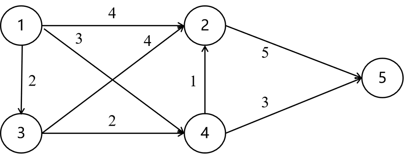

## 概述

​		贪婪算法与最优化问题联系较深，它可以是最优解的一个近似解，但是不保证是最优解，这样的算法称为启发式算法。

### 渴婴问题

​		一个婴儿想喝饮料解渴，现在有n种饮料，每个饮料的存量为s1,s2...,sn，喝第n种饮料的满意度为tn。婴儿希望在总体满意度最大的情况下还解渴，限制条件是解渴至少需要喝t存量的饮料。

​		这个问题可以描述为，是否存在一组解x1,x2,..xn，使Σxiti的乘积和最大，且满足Σxi=t。这个问题在Σsi＜t是无解的，因为全部饮料喝完也不能解渴。

​		贪婪算法，可以理解为总是寻找满意度最大的饮料，同时还要保证这些饮料存量能够大于等于t，看起来还不是太直观，可以考虑装载问题。

### 装载问题

​		一个轮船有最大载重k，有一对货物箱子，每个箱子都是一种货物，每个箱子的重量不同，记为wi。现在想要不超过最大载重k的情况下，尽可能的装更多种类的货物。

​		用数学描述为，寻找一组解x1,x2,..xi，使得Σwixi=c，且Σxi最大，因为xi取值非0即1。

​		贪婪算法，总是找重量小的箱子，以尽可能的满足种类多，然后保证不超重即可。

### 找钱问题

​		找钱问题可能是最直观的贪婪算法思想，售货员希望数目最少的钱币来找钱。假如存在1元、5元、10元和20元的面额，现在找钱77，那应该怎么做呢？

​		贪婪算法就是每次总优先选择面额大的钱币，再选择小的，保证等于要找的钱即可。例如77元先拿20元的3张，10元的1张，5元的张总额为75，再拿2张1元的即可完成找钱。

​		贪婪算法有一种直觉认知，这样凑出的零钱能够使得钱币数目最少或者接近最少，事实上在找钱问题中，确实可以证明这样找钱的方式是钱币最少的，是最优解。

​		但是不是所有问题贪婪算法都是最优解，例如下方的最短路径问题。

### 最短路径问题

​		假如存在这样的有向图，从起点①到终点⑤，选择最短的路径。这里最短的路径不是距离最短，每条边上的值代表走这条边的代价，可以理解为几个城市的通信问题，距离存在远近，通信成本就会有所不同。现在的需求是，找到一条成本最低的路径。



​		贪婪算法怎么做呢？

​		因为路径想要最短，所以每次寻找代价成本最低的。从起点①出发，代价最小的是2，也就是前往③，之后代价最小的是2，前往④；之后继续，代价最小的是1，前往②，然后只剩下唯一的路径前往终点⑤，代价是5。

​		所以总的成本的2+2+1+5=10，实际上这不是最优解，有其他的很多选择比它更优。这个问题的最优解是从①到④再到⑤，总的代价为3+3=6。

## 应用

​		应用有很多的问题，货箱装载问题、背包问题、拓扑排序问题、二分覆盖问题、最短路径问题和最小代价生成树的问题。

​		考虑到难度，这里只说明货箱装载问题，其他跳过。

### 货箱装载问题

​		解决这个问题，先定义一个描述货箱的数据结构，有货物类别id和货箱重量weight，id从1开始编号，到总的货箱个数n。

​		这个数据类型的结构体C++代码如下。

```c++
struct container
{
    int id, weight; // 货箱的货物类别和重量
    operator int() const { return weight; }
};
```

​		找到合适的一组值xi，这个xi用数组x去描述。然后首先需要对货箱按重量进行排序，按照贪婪算法，从更轻的货箱依次纳入。

​		解决代码的C++如下。

```c++
void containerLoading(container* theBoxes, int capacity,
	int numberOfBoxes, int* x) {
	// 使用1个排序按照重量从小到大排,这里为了简单
	// 测试的案例就已经从小到大的重量
	// 为何从小到大排呢?贪婪算法总是找最小的尽可能让数量多
	int n = numberOfBoxes;
	for (int i = 1; i <= n; i++) {
		x[i] = 0; // 先全部初始化为0
	}

	// capcaity是剩余的容量
	for (int i = 1; i <= n && theBoxes[i].weight <= capacity; i++) {
		x[theBoxes[i].id] = 1; // 按照货箱编号存放在x的对应索引
		capacity -= theBoxes[i].weight; //减去使用过的货箱重量
	}
}
```

​		测试案例。

```c++
void _chapter17_containerLoading() {
	container* theBoxes = new container[11]; // 下标0弃用
	for (int i = 1; i <= 10; i++) {
		theBoxes[i].id = i;
		theBoxes[i].weight = i * 5;
	}
	// 5,10,15,20,25,30,35,  40,45,50
	// Σ{5->35}=140,后边的就超了
	int* x = new int [11]; // 最优解
	int capacity = 150; //最多承载150
	containerLoading(theBoxes, capacity, 10, x);
	cout << "the best x is\n";
	for (int i = 1; i <= 10; i++) {
		cout << "(" << theBoxes[i].id << "," << x[i] << ")  ";
	} // 7个1,3个0
	cout << endl;
}
```

本章结束~其它跳过。


