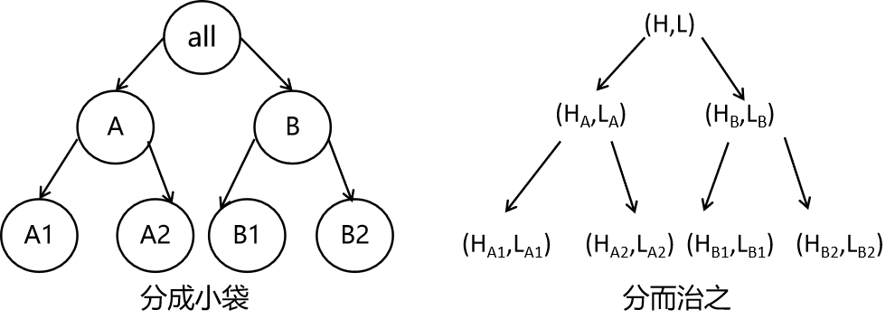

## 概述

​		分而治之的思想在于，把一个问题实例分解若干个小型而独立的实例，一般小实例也是原问题的实例，然后分而治之使用递归方法进行求解。例如在二叉树的相关问题中就常常使用递归，因为一个树节点总是具备同样的操作，合适的递归方法就可以解决所有树节点的问题，最后组合成树的解，因为树的根本身也是树节点。

### 假币问题

​		16个硬币中有1个假币，设定假币比真币轻，现在有个天平可以去比较两组硬币的重量，去找出这个假币。

​		一种解法是对16个硬币进行8次偶数循环，两两进行比较，有轻的就找到，否则一直必到所有硬币都比较过为止。最好的情况下，第1次就找到硬币，最坏的情况下第8次才能找到，平均为4.5次。

​		另一种解法把16个硬币看作一组大实例，分成2组A和B，每组有8个硬币，那么比较1次就知道假币会在哪组。假定B组更轻，将其二分为2个组B1和B2，比较1次直到假币的位置假定是B1；然后继续分割，每组2个实例，这已经到了最小分割实例，必定能找到那个假币。这种比较方法只需要比较3次，而且是固定的比较次数，比平均4.5次要好。

### 金块问题

​       8袋金块，找出最重的金块和最轻的金块。

​		这个问题可以使用普通的循环比较方法找到，设定1个变量初始为第1块金块，然后比较n-1次，如果后边有金块比它重就更新这个变量的值。这样最终变量就找到了最大的那个金块，然后在余下的n-1个金块同样的方法比较n-2次可以得到最轻的金块，总计需要比较2n-3次；

​		也可以同时设定2个变量值记录最大和最小，一次循环过程同时比较2个变量值和当前金块，使用2个独立的if，需要2n-2次比较；

​		还可以进一步优化，在比较记录最大值的变量和当前金块后，使用else ，而不是独立的2个if。因为如果当前金块值比目前最大值大的话，则当前的金块一定不会是最轻的；反过来也一样，比目前最轻值还轻的金块也不会是最重的金块，所以2个if执行1个就可以。这个方法最多执行2n-2次；

​		如果是8个金块，以上方法分别需要比较13、12次和最多需要比较12次。

​		现在来看看分而治之的策略需要比较多少次。

​		假设金块先分为4组，每组2个，那么每组需要比较1次，就可以知道每组更重和更轻的那个，一共需要4次比较，这是最小的实例；

​		然后比较前2组两个各自最重的金块和2个各自最轻的金块就可以知道这2组整体最重和最轻的金块，0后2组同理，这是次之的实例，一共需要比较4次；

​		最后还要比较前2个组和后2个组的最大和最小金块，从而得到整体8个金块中最大和最小的金块，这需要比较2次，最终需要比较10次。比较次数和最初元素的个数n存在一些规律，为了方便，假设n是2的幂数，假设比较次数为T(n)，显然T(2)=1。

​		观察可知，1个节点下边的2个子节点需要比较2次，每个子节点又要各自比较2次(已经假设n是2的幂数)，所以每个父节点总是它的子节点的比较次数乘2。同时1个父节点除了全局根节点外必然会有兄弟节点，所以还要算上2次和兄弟节点的比较才能得到更上一级的节点。所以递推公式显而易见有T(n) = 2 * T(n/2) + 2。

​		这个思路有一些像二叉树，事实上二叉树就是应用分而治之递归策略最多的数据结构。金块问题用二叉树示意图如下。



## 应用

​		本章的应用问题有最小最大问题、矩阵乘法、残缺棋盘问题、归并排序和快速排序、选择和二维空间寻早距离最近的2个点。

### 最大最小问题

​		在数组中找到最大和最小的值索引，这个在概述中已经提过，如果以第2章的算法需要比较2n-3或者2n-2次，现在尝试使用分而治之的算法去解决这个问题。可以证明，这个算法是在寻找最大和最小值问题中，比较次数最少的算法。

​		C++代码实现如下。

```c++
template<class T>
bool minMax(T a[], int n, int& minIndex, int& maxIndex) {
	// 在a[0,n-1]内找出最大最小值
	if (n < 1) return false;
	if (n == 1) {
		minIndex = maxIndex = 0; 
		return true;
	}
	int start ; // 循环的起点取决于n的奇偶性

	if (n % 2 == 1) { // 奇数,那就拿出1个作为初始最大最小值,后边偶数个元素可以两两比较
		minIndex = minIndex = 0; // a[0]认为是一开始最大和最小的元素
		start = 1; // (1,2),(3,4)...这样两两比较
	}
	else { // 偶数,拿出1个值会有问题,所以拿出2个,所以先比较2个元素
		if (a[0] > a[1]) { // 先比较2个元素a[0]和a[1]
			minIndex = 1;
			maxIndex = 0;
		}
		else {
			minIndex = 0;
			maxIndex = 1;
		}
		start = 2; // 从a[2]开始比较
	}

	// 剩余元素必定是偶数个
	for (int i = start; i < n; i += 2) {
		if (a[i] > a[i+1] ) { // 如果前1个元素大
			if (a[i] > a[maxIndex]) maxIndex = i; // 则让前1个元素和目前最大的比较
			if (a[i + 1] < a[minIndex]) minIndex = i+1; // 后1个元素和目前最小的比较
		}
		else { // 后1个元素大,则正好反过来
			if (a[i+1] > a[maxIndex]) maxIndex = i+1;
			if (a[i] < a[minIndex]) minIndex = i;
		}
	}
	return true;
}
```

​		最大最小值方法还给出了递归方法解决，具体可见leetcode的刷题记录。

​		这里给出整型时的递归方法。

```c++
class linearArrayFindMinMaxValRecursion{
    public:
        pair<int,int> findMinMaxVal(int * a,int n){
            pair<int,int> ans;
            if (n < 1)  return ans;
            
            if (n == 1){
                ans.first = ans.second = a[0];
                return ans;
            }
        
            if (n % 2 == 1){
                ans.first = ans.second = a[0];
                int * temp = new int [n-1];
                copy(a+1,a+n,temp);//注意复制的时候不要忘记+n
                a = temp;
                n--;
            }
            else{
                if (a[0] > a[1]){
                    ans.first = a[1];
                    ans.second = a[0];
                }
                else{
                    ans.first = a[0];
                    ans.second = a[1];
                }
                int * temp = new int [n-2];
                copy(a+2,a+n,temp);
                a = temp;
                n -= 2;
            }
            
            if (n<1) return ans;

            if (n!=2){
                //const int m = n / 2 ;
                int * a1 = new int [n/2];
                int * a2 = new int [n-n/2]; // 偶数可能造成3/2=1的情况
                copy(a,a+n/2,a1);
                copy(a+n/2,a+n,a2);
                pair<int,int> left = findMinMaxVal(a1,n/2);
                pair<int,int> right = findMinMaxVal(a2,n-n/2);
                ans.first = min(min(left.first,right.first),ans.first);
                ans.second = max(max(left.second,right.second),ans.second);
                return ans;
            }
            else{
                ans.first = min(min(a[0],a[1]),ans.first);
                ans.second = max(max(a[0],a[1]),ans.second);
                return ans;
            }
        }
};
```

### 归并排序问题

​		把1个子序列分成k个子序列（k≥2），然后对每一个子序列排序，最后归并。

​		先看最简单的情况，如果k=2，称为2路划分。

​		2路划分有一种方式是一个子序列A只有1个元素，另一个子序列B有剩余的元素；另一种方式是子序列A有n/k个元素，B包含剩余的元素；

​	  先考虑A只有1个元素的情况，这个元素是原n个元素的最后1个，因为A只有1个元素，所以A已经有序。此时B有前n-1个元素，递归的对B进行进行排序，那么B可以分出n-2个元素，另1个元素以由小到大的方式插入到A中；依次类推，B反复分出最后1个元素，直到B只有1个元素，这个元素也插入到A中合适的位置，最后A成了一个有序的数组。可以观察到这是插入排序的递归形式。

​		如果每次不是把最后1个元素放入A，而是每次把最大的元素放入A，那么A无需插入，只要放在A的尾部即可。根据寻找最大的元素的过程不同，还可以分为选择排序的递归方式与冒泡排序的递归方式。

​		上述过程是将序列分成2个极不平衡的子序列，然后独立排序。现在假设A包含n/k个元素，B为剩下的元素，递归的对A和B排序，然后使用一个归并函数将有序子序列合并为1个序列。

​		当生成的较小实例个数为2，且A划分后的子序列具有n/k元素时，算法可以得到最后结果。

​		伪码如下。

```c++
void sort(E,n)
{
    // k是全局变量
    if (n > k)
    {
        i = n/k ;
        j = n - i;
        令A为E的前i个元素构成
        令B为E剩余的j个元素构成
        sort(A,i);
        sort(B,j);
        merge(A,B,E,i,j); // 归并到E
    }
    else
        对E插入排序
}
```

​		细化的C++代码如下

```c++
void mergeSort(T*a,int left, int right)
{
    //对数组元素[left,right]排序
    // 递归反复得到子序列的边界left和right
    {
        // 至少2个元素
        int middle = (left+right)/2;
        mergeSort(a,left,middle);
        mergeSort(a,middle+1,right);
        copy(b,a,left,right);
    }
}
```

​		具体的mergeSort代码如下，但是目前这个程序似乎有些问题，不能运行。

```c++
template<class T>
void mergeSort(T a[], int n)
{
	T* b = new T[n];
	int segmentSize = 1;
	while (segmentSize < n) {
		mergePass(a, b, n, segmentSize); // 负责得到需要归并的子序列的左右边界
		segmentSize += segmentSize;
		mergePass(b, a, n, segmentSize);
		segmentSize += segmentSize;
	}
}
template<class T>
void mergePass(T x[], T y[], int n, int segmentSize)
{
	// 负责得到需要归并的子序列的左右边界
	// 从x到y归并相邻的数据段
	int i = 0;
	while (i <= n - 2 * segmentSize)
	{
        merge(x, y, i, i + segmentSize - 1, i + 2 * segmentSize - 1);
        i = i + 2 * segmentSize;
	}
	// 少于2个满数据段
	if (i + segmentSize < n) {
		merge(x, y, i, i + segmentSize - 1, n - 1);
	}
	else { // 只剩1个数据段,复制到y
		for (int j = i; j < n; j++)
			y[j] = x[j];
	}
}
template<class T>
void merge(T c[], T d[], int startOfFirst, int endOfFirst, int endOfSecond)
{
	// 把2个相邻数据段从c归并到d
	int first = startOfFirst; // 第1个数据段的索引
	int second = endOfFirst + 1; //第2个数据段的索引
	int result = startOfFirst;// 归并数据段的索引

	// 直到1个数据段归并到d
	while ((first <= endOfFirst) && (second <= endOfSecond)) {
		if (c[first] <= c[second])
			d[result++] = c[first++];
		else d[result++] = c[second++];
	}
	//	// 归并剩余元素
		if (first > endOfFirst)
			for (int q = second; q <= endOfSecond; q++) {
				d[result++] = c[q];
			}
		else
			for (int q = first; q <= endOfFirst; q++) {
				d[result++] = c[q];
			}
}
```

### 快速排序问题

​		可以采用递归的快速排序，其代码如下。

```c++
template <class T>
void quickSort(T a[], int n)
{// Sort a[0 : n - 1] using the quick sort method.
    if (n <= 1) return;
    // move largest element to right end
    int max = indexOfMax(a, n);
    swap(a[n - 1], a[max]);
    quickSort(a, 0, n - 2);
}
```

​		也可以使用更复杂的算法，这里不再分析，主要是不会。。也不想看了，想尽快看下一本书。

```c++
template <class T>
void quickSort(T a[], int leftEnd, int rightEnd)
{// Sort a[leftEnd:rightEnd], a[rightEnd+1] >= a[leftEnd:rightEnd].
    if (leftEnd >= rightEnd) return;

    int leftCursor = leftEnd,        // left-to-right cursor
        rightCursor = rightEnd + 1;  // right-to-left cursor
    T pivot = a[leftEnd];

    // swap elements >= pivot on left side
    // with elements <= pivot on right side
    while (true)
    {
        do
        {// find >= element on left side
            leftCursor++;
        } while (a[leftCursor] < pivot);

        do
        {// find <= element on right side
            rightCursor--;
        } while (a[rightCursor] > pivot);

        if (leftCursor >= rightCursor) break;  // swap pair not found
        swap(a[leftCursor], a[rightCursor]);
    }

    // place pivot
    a[leftEnd] = a[rightCursor];
    a[rightCursor] = pivot;

    quickSort(a, leftEnd, rightCursor - 1);   // sort left segment
    quickSort(a, rightCursor + 1, rightEnd);  // sort right segment
}
```

### 选择第k小的元素问题

​		其代码如下，也不再分析。

```c++
template <class T>
T select(T a[], int n, int k)
{// Return k'th smallest element in a[0 : n - 1].
    if (k < 1 || k > n)
        throw illegalParameterValue("k must be between 1 and n");

    // move largest element to right end
    int max = indexOfMax(a, n);
    swap(a[n - 1], a[max]);
    return select(a, 0, n - 1, k);
}

template <class T>
T select(T a[], int leftEnd, int rightEnd, int k)
{// Return k'th element in a[leftEnd:rightEnd].
    if (leftEnd >= rightEnd)
        return a[leftEnd];
    int leftCursor = leftEnd,        // left-to-right cursor
        rightCursor = rightEnd + 1;  // right-to-left cursor
    T pivot = a[leftEnd];

    // swap elements >= pivot on left side
    // with elements <= pivot on right side
    while (true)
    {
        do
        {// find >= element on left side
            leftCursor++;
        } while (a[leftCursor] < pivot);

        do
        {// find <= element on right side
            rightCursor--;
        } while (a[rightCursor] > pivot);

        if (leftCursor >= rightCursor) break;  // swap pair not found
        swap(a[leftCursor], a[rightCursor]);
    }

    if (rightCursor - leftEnd + 1 == k)
        return pivot;

    // place pivot
    a[leftEnd] = a[rightCursor];
    a[rightCursor] = pivot;

    // recursive call on one segment
    if (rightCursor - leftEnd + 1 < k)
        return select(a, rightCursor + 1, rightEnd,
            k - rightCursor + leftEnd - 1);
    else return select(a, leftEnd, rightCursor - 1, k);
}
```

其他问题跳过。

本章结束~下一章节为动态规划。

