# 1.配置Git

​		学习Git参考网址：[Git 基本操作 | 菜鸟教程 (runoob.com)](https://www.runoob.com/git/git-basic-operations.html)

​		Git配置参考网址：[【狂神说Java】Git最新教程通俗易懂_哔哩哔哩_bilibili](https://www.bilibili.com/video/BV1FE411P7B3?p=8)

## 1.1下载地址

​		下载地址：[Git - Downloading Package (git-scm.com)](https://git-scm.com/download/win)

## 1.2 Git相关工具配置

​		下载完后，win+x打开power shell，输入命令 winget install --id Git.Git -e --source winget，等待工具配置完毕。

## 1.3 终端区别

​		git bash：unix和linux风格的命令行，使用最多，清空终端输出对应clear

​		git cmd：windows风格的终端，清空终端输出对应cls

​		git gui：图形界面的git，不建议初学者使用

## 1.4 常见命令

### 1.4.1 文件操作命令

​		ls：列出用户文件夹的所有文件

​		cd：进入某个目录

​		cd ..：回退目录，注意必须有空格

​		pwd：显示当前目录所在路径

​		touch：新建1个文件，如touch hello.cpp

​		rm：删除1个文件 如rm hell0.cpp就是删除文件hello.cpp

​		mkdir：新建文件夹

​		rm - r：删除1个文件夹，如rm -r src删除src文件夹

​		mv：移动文件，mv hello.cpp src hello.cpp，要求src和hello.cpp是同一目录

​		reset：重新初始化终端

​		clear：清屏

​		history：查看命令历史

​		exit：退出

​		help：帮助

​		#：注释

### 1.4.2 Git配置命令

​		Git的配置文件都保存在本地，所以是可以修改的。例如C:\Users\chenb\ .gitconfig文件以及C:\Git\etc\gitconfig文件。

​		C:\Git\etc\gitconfig文件是安装目录的文件，其内容如下，对应的就是git config -l命令显示的内容。

```bash
[diff "astextplain"]
	textconv = astextplain
[filter "lfs"]
	clean = git-lfs clean -- %f
	smudge = git-lfs smudge -- %f
	process = git-lfs filter-process
	required = true
[http]
	sslBackend = openssl
	sslCAInfo = C:/Git/mingw64/ssl/certs/ca-bundle.crt
[core]
	autocrlf = true
	fscache = true
	symlinks = false
[pull]
	rebase = false
[credential]
	helper = manager-core
[credential "https://dev.azure.com"]
	useHttpPath = true
[init]
	defaultBranch = master
```

​		C:\Users\chenb\ .gitconfig是用户文件夹下的文件，其内容如下。

```bash
[core]
	editor = \"C:\\VSCode\\bin\\code\" --wait
```

​		git config -l 查看Git配置

​		git config --system --list 查看Git关于系统方面的配置

​		git config --global --list 查看用户的账户和密码

​		git config -e --global 首次是没有配置文件.gitconfig的，需要使用该命令配置

​		git config --global --edit 和git config -e --global命令是一个意思

​		git config --global user.name "chenbei97" 设置用户名

​		git config --global user.email chenbei_electric@163.com 设置邮箱

​		注：global是全局配置，那么Git总会依据该信息来处理在系统的一切操作。如果希望不同的项目使用不同的名称或者email地址，不要使用--global选项。

​		设置完用户名和邮箱后（用户名和邮箱是必须配置的），.gitconfig文件的内容是

```bash
[core]
	editor = \"C:\\VSCode\\bin\\code\" --wait
[user]
	name = chenbei97
	email = chenbei_electric@163.com
```

### 1.4.3 Github命令

​		上传代码流程：WorkingDirectory(工作目录)->git add->Stage(提交到暂存区)->git commit->History(本地仓库)->git push->RemoteDirectory(远程仓库)

​		下载代码流程：RemoteDirectory(远程仓库)->git pull->History(本地仓库)->git reset->Stage(暂存区)->git checkout->WorkingDirectory(工作目录)

​	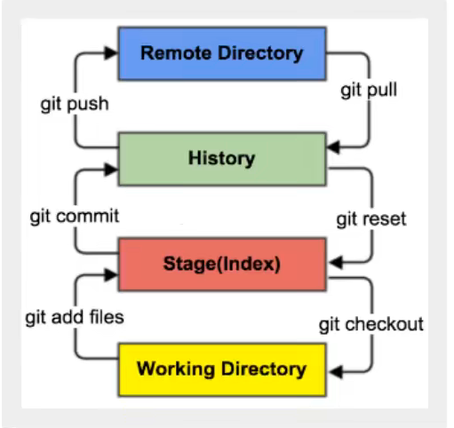

​		git init：初始化仓库

​		git add files：添加单个文件到暂存区

​		git add .：提交全部文件到暂存区

​		git commit -m ：提交所有文件到本地仓库，跟上消息内容，例如git commit -m "create hello.cpp"

​		git push：上传文件到远程仓库并合并

​		git pull：下载远程代码到本地仓库并合并

​		git reset：用于回退版本，可以指定退回某一次提交的版本

​		git branch branchName：创建新分支

​		git branch -d branchName：删除指定分支

​		git push origin --delete branchName：删除指定远程分支

​		git branch -dr[remote/branch]：

​		git checkout branchName：切换到新分支

​		git switch branchName：切换到已有分支

​		git checkout -b branchName：创建并切换到新分支

​		git merge branchName：合并指定分支到当前分支

​		git status：查看仓库当前的状态，显示有变更的文件

​		git rm：删除工作区文件

​		git mv：移动工作区文件，例如git mv Git和Vscode配置.md markdown，移动md文件到目录markdown下

​		git log：查看历史提交记录

​		git remote：远程仓库操作

​		git diff：比较文件的不同，即暂存区和工作区的差异

​		git clone：拷贝一份远程仓库，也就是下载一个项目，例如git clone https://github.com/chenbei97/ComputerVision.git

​		git fetch：从远程获取代码库

​		

​		一些文件的作用：

​		HEAD：指向最新放入仓库的版本，在切换分支的时候，HEAD也会相应的指向对应的分支引用

​		.git：隐藏文件夹，存放Git管理信息的目录，初始化仓库时自动创建

​		Index/Stage：暂存区，待提交更新区，提交进入repo之前所有的更新放在暂存区

​		Local Repo：本地仓库，本地的版本库，HEAD是当前的开发分支

​		Stash：隐藏文件，是一个工作状态保存栈，用于保存/恢复WorkSpace的临时状态

​		.gitignore：某些文件不想纳入版本控制，例如数据库文件、临时文件和设计文件，则在主目录下可以建立该文件，该文件有几个规则。

​		这个文件会忽略文件中的空行和以井号#开始的行；

​		可以使用Linux通配符，例如 * 可以代表任意多个字符，问号？可以代表1个字符，方括号[abc]代表可选字符范围，大括号{str1,str2,..}代表可选的字符串等；

​		 名称的最前边有一个感叹号!，表示例外规则，将不被忽略；

​		名称的最前边是路径分隔符(/)，表示要忽略的文件在此目录下，子目录的文件不忽略；

​		名称的最后边是路径分隔符(/)，说明忽略的是此目录下该名称的子目录而非文件。

```bash
*.txt #忽略所有.txt结尾的文件
!lib.txt # 但lib.txt文件除外
/temp # 忽略和temp同级别的的某个文件，temp的文件不忽略
build/ # build下的所有文件都忽略
doc/*.txt # doc下的某个txt文件忽略,但是doc/server/目录的txt不会忽略
```

## 1.5 Git工作流程

​		工作目录添加、修改文件

​		需要版本管理的文件放入暂存区域

​		将暂存区域的文件提交到git仓库

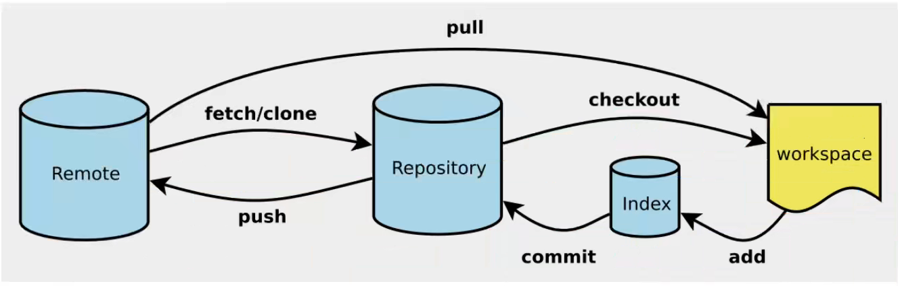

​		所以，git管理的文件主要有3种状态，已修改(modified)、已暂存(staged)、已提交(committed)，其实还有2种状态是未提交(untracked)和未修改(unmodify)。

​		untracked：文件在文件夹中，但没有加入到git库，可以通过git add变成Staged状态

​		unmodify：文件在本地仓库且未修改，即工作区的文件内容和本地仓库的完全一样。这种类型文件有2个去处，如果它被修改就变成modified然后可以再次add，或者git rm从工作区移除文件

​		modified：文件已经修改，仅仅是修改没有其他操作，那么可以通过git add进入staged区，或者使用git checkout丢弃修改的内容返回到unmodify状态，相当于从本地仓库文件覆盖掉工作区修改的文件

​		staged：此时可以执行git commit同步到本地仓库，那么本地仓库和工作区文件又变为一致，文件为unmodify状态，执行git reset HEAD filename取消暂存，文件状态为modified，取消暂存就是取消回退版本，版本已经更新过。

## 1.6 创建分支

​		重点说明git branch的使用方法。

​		git branch：列出所有本地分支

​		git branch -r：列出所有远程分支

​		git branch [name]：新建一个分支，但是依然停留在当前分支

```bash
git branch dev  新建名称为dev的git分支
```

​		git checkout [name]：切换到新分支

```bash
git checkout dev
```

​		从图片可以看出，切换分支后，绿色字体从master变为dev。

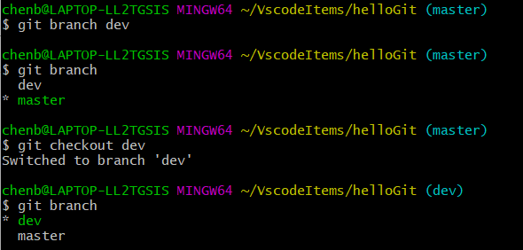

​		git checkout -b [name]：新建一个分支并切换到该分支，是两个命令的结合

​		git merge [name]：主分支代码master是稳定版本，分支dev的代码稳定后再合并到主分支

## 1.7 创建密匙

### 1.7.1 Github

​		创建密匙的前提是全局邮箱和用户名是正确的，要和github一致，即

```bash
git config --global user.name "chenbei97" 设置用户名
git config --global user.email chenbei_electric@163.com 设置邮箱
```

​		首先使用git clone自己的项目到本地文件夹，路径地址为C: \ \ Users \ \ chenb \ \ VscodeItems \ \ ComputerVision

```bash
cd C:\\Users\\chenb\\VscodeItems
mkdir .ssh
cd .ssh
```

​		输入下边任一个命令即可。

```bash
ssh-keygen
ssh-keygen -t rsa -C chenbei_electric@163.com
```

​		运行上面命令后会让你输入一个文件名，用于保存刚才生成的 SSH key 代码，例如输入key会生成key.pub和key 2个文件。接着又会提示你输入两次密码，该密码是你push文件的时候要输入的密码，而不是github管理者的密码。也可以不输入密码，直接按回车，那么push的时候就不需要输入密码，直接提交到github上。

​		SSH密匙就在key.pub中，可以使用文本方式打开直接复制，也可以使用命令行复制，自动复制在剪贴板上。

```bash
clip < key.pub
```

​		内容如下。

```bash
ssh-rsa AAAAB3NzaC1yc2EAAAADAQABAAABgQDFUejg3G/E2PncVK7Whl73OShxPKA288WInIaffdOJQjOlRM2AgA5P5d6WOmV/DSCFGEasrEiFXRuhgKc+z17e1Ql5sfWiPmi7enMB0NMAuxgD6S1tEhDPZRAL8ezZcftA89/nDtHvPDzly/Eofjg1lw4RioBp4XpM0a7MwonpEwOkvES8ZbFJ/LUHfK/fXQSN82hwv3h2YVly6ORl/aVRqixOTQy4uLSiMkcM0zrKnHQPw0yehxcldwtyOEUhuJt9dMLYUTQuLRobXbNynFOIDR5vnmSXmngZTIkf8FR99mgzpQXNuF7P9lHVJkHhueh/K7OVQNx3+gTVbGoCXHyBwtCxCzXDVfGfU/Q1l/ZWG1BBqz7Ndp30mlgt7G5v/2pN7zRenpc5JdsUUCs7aUwI+ZBGw2/zGqggsuqyUKyJjaM3WzlVKcAtnN8qLS5mv64Hn6E60ApEKB52PjtajEnSYfoWRFFR8l1JZsD2y9PTz0WIYeRr8AtlM+cC8TJGrHE= chenbei_electric@163.com
```

​		然后就是把密匙添加到GitHub，在个人设置中找到SSH and GPG keys给密匙取名字即可。

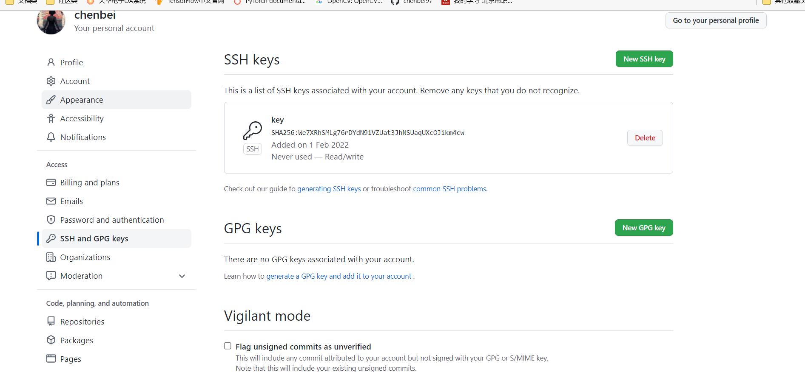

​		测试密匙是否有用的命令

```bash
ssh -T git@github.com
```

​		会弹出一段警告，输入 yes 回车即可。如果你创建 SSH key 的时候设置了密码，接下来就会提示你输入密码。如果用户名是正确的，你已经成功设置SSH密钥。如果你看到 access denied ，表示拒绝访问。如果出现下方这样的消息

```bash
git@github.com: Permission denied (publickey)
```

​		可以使用下方命令

```bash
ssh-agent -s
ssh-add key 在.ssh文件夹下
```

​		如果之前设置密匙输入了密码，就会提示输入密码，再次使用ssh -T git@github.com命令，就会得到链接成功的消息。

```bash
Hi chenbei97! You've successfully authenticated, but GitHub does not provide shell access.
```

​		如果提示

```
Could not open a connection to your authentication agent
```

​		那么输入命令

```bash
ssh-agent bash
ssh-add key 再次输入,提示输入密码即可
ssh -T git@github.com 再次测试
```

​		上述还有个问题在于，VscodeItems下的.ssh文件夹是自行创建的，但是c/Users/chenb/的.ssh文件夹是自动创建的，里边会有known_hosts文件。现在再次输入命令申请1个新密匙，创建名称为newKey的密匙文件，但是不输入密码。

```bash
ssh-keygen
clip < newKey.pub
ssh -T git@github.com
```

​		新密匙的内容。

```bash
ssh-rsa AAAAB3NzaC1yc2EAAAADAQABAAABgQC99dvaz4qHJwcqLRtgVG0A0W19+eXiZ3EzTg8Je8ZnCj9zFLsO2lboZ36YY5drTep1FQA6GWt1EFn2zJul3ZIvKTjWuvqhrmqm9oaHiLhfPekmYWvrn8TZAQ0p6EqS3RPqWCgc8HRHTSJkHdjZ/WvswdYOrhQtOFwZ8hPhPhOKYw8g0FZw3YGXS8yX+a5bM5iCdoR5+q85ghICIrpQmuZaHlvOxY9xTD/oyjfWpPvSCT+4IeBufoOgkMEDVL+/kH2n81UYT8N62ku6qpmUPccVa1ELHxSuXXQXoz8UxEkBHyiH2yhGFu30DDPXBJcyjXh8N5Z/lcBRF5NToABm+usITyc7d6cKG2R9J37AouWw6Q9A89prNeuP86WCN+xnt9RaTDhHYh/4XmioRjr8nPx/XZa+BHl19IeXrX/R/3tBSFawZNhBu98Dc8L0iSlpc+mh1v/bhKG/vIAqLsEebrC67CyhYrHGrSx4E6PRS8MgFTWMyKOuIi0yH6xMs+idWvE= chenb@LAPTOP-LL2TGSIS
```

​		chenb/的.ssh文件夹又会多1个文件，名称为known_hosts.old，验证直接成功无需输入密码。

​		此时也可以使用ssh命令来下载项目了，不仅仅是https的命令。Github找到项目的code这里，就可以复制这个命令链接。

```bash
git clone git@github.com:chenbei97/ComputerVision.git
```

### 1.7.2 Gitee

​		命令是类似的，也是创建新的密匙，名称为cb199791.pub，只是验证密匙变得不同。前提是全局邮箱和用户名要改为gitee对应的，才会链接成功。

```
ssh-keygen
clip < cb199791.pub
ssh -T git@gitee.com
输出信息：
Hi 陈北! You've successfully authenticated, but GITEE.COM does not provide shell access.
```

```bash
ssh-rsa AAAAB3NzaC1yc2EAAAADAQABAAABgQDcGBmWuqHe23n8R2yf/+ebvIa35bXCiY72wyHSk/4/KQbtcksbeR6Otf4guZO1tll0Qh10LFpQ3pcwOD++n797RuJ96etKhWyC5Bo4svKbHmaX5qOpFRLabDnLeUOo1NxdJQPdf6ZHqXe60lLsvtZ66yTKGJu6WoOdPnsycXqYUrTIUWf9CRFGxg1R9qVPIe0rSoBcznrYO6tTwq1qNPuPuKq6r5JfCW8BLcuvuV8NrL/ppl3TPolGs5H30hKxQKCGeFYkU1up4lJ+XYmXP60grOvcFrW5776/f1CCwtoSkRaIgf0C6evVTo6uLefOgOk8yCFaddKQovvx6pxYfPqeUP2H4XQ7keEsEI+jYXDoutKZ6f0H0k1PpF7enCOvw59UsgpDtMbRO1xg6CtBWQrXz1W6Zv5Uj6QPXIbYlZINMxpnXQOX06evahUlonFIr32bUjkTHPRJPyXunpRPcevLaxrZwHlvVeKC+2UcWJwBN/xsIuYjSpTUlz8RZulCxCE= chenbei_electric@163.com
```

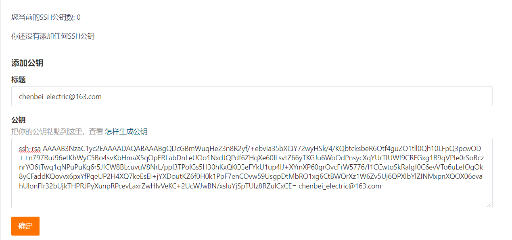

## 1.8 创建仓库的案例

​		初始化仓库可以在项目文件夹中初始化，这样就可以在VisualStudio或者Pycharm等直接实现文件的上传和更新了。

```bash
cd C:\\Users\\chenb\\VscodeItems  要用双引号
mkdir helloGit  创建1个文件夹
cd helloGit
git init  初始化仓库,多1个.git隐藏文件夹 也可以使用git clone [URL]来初始化仓库
touch hello.cpp 创建1个文件
git add hello.cpp 提交到暂存区
git status 查看仓库状态
git commit -m "create hello.cpp" 提交到本地仓库
git status 查看仓库状态
```

# 2.配置vscode

## 2.1 下载地址

​		下载地址：[Visual Studio Code - Code Editing. Redefined](https://code.visualstudio.com/)

## 2.2 配置C++

​		配置过程参考网址：[Get Started with C++ and Mingw-w64 in Visual Studio Code](https://code.visualstudio.com/docs/cpp/config-mingw)

### 2.2.1下载扩展

​		Ctrl+Shift+X快捷键，搜索c++下载扩展

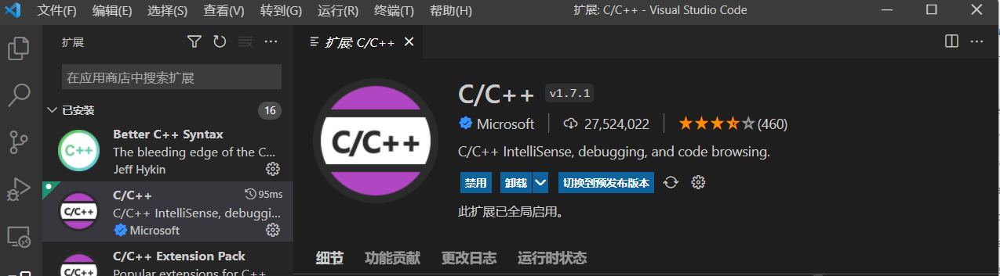

### 2.2.2下载MSYS2

​		1. 下载地址：[MSYS2](https://www.msys2.org/)，然后安装在C盘目录

​		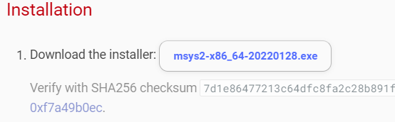

​		2. 打开终端 < MSYS2 MSYS >，输入命令 < pacman -Syu >，用于更新包数据库和基础包。

​		3. 从开始菜单再次打开终端< MSYS2 MSYS >，更新其余的基础包，输入命令< pacman -Su >

​        4. MSYS2 已经安装好，还需要安装一些工具和 mingw-w64 GCC 来开始编译。终端输入命令

```cmake
pacman -S --needed base-devel mingw-w64-x86_64-toolchain
```

​		运行结果如下，默认全部安装，敲回车即可。

```cmake
1) mingw-w64-x86_64-binutils  2) mingw-w64-x86_64-crt-git
3) mingw-w64-x86_64-gcc  4) mingw-w64-x86_64-gcc-ada
5) mingw-w64-x86_64-gcc-fortran  6) mingw-w64-x86_64-gcc-libgfortran
7) mingw-w64-x86_64-gcc-libs  8) mingw-w64-x86_64-gcc-objc
9) mingw-w64-x86_64-gdb  10) mingw-w64-x86_64-gdb-multiarch
11) mingw-w64-x86_64-headers-git  12) mingw-w64-x86_64-libgccjit
13) mingw-w64-x86_64-libmangle-git  14) mingw-w64-x86_64-libwinpthread-git
15) mingw-w64-x86_64-make  16) mingw-w64-x86_64-pkgconf
17) mingw-w64-x86_64-tools-git  18) mingw-w64-x86_64-winpthreads-git
19) mingw-w64-x86_64-winstorecompat-git
```

​    5.  要使用 mingw-w64 GCC 开始构建，从开始菜单运行MSYS MinGW 64-bit，现在可以调用 make 或 gcc/g++  构建软件

注意使用的是不一样的终端。常见的编译命令是g++ -o Test.exe Test.cpp

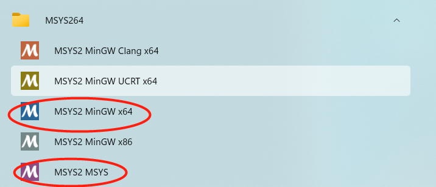

​		6.  把Mingw-w64 bin 文件夹的路径添加到 Windows PATH 环境变量，右击电脑属性找到环境变量。

```cmake
C:\msys64\mingw64\bin
```

​		要检查您的 Mingw-w64 工具是否已正确安装且可用，请打开一个新的命令提示符并键入

```cmake
g++ --version
gdb --version
```

​		输出结果分别是

```
g++.exe (Rev8, Built by MSYS2 project) 11.2.0
Copyright (C) 2021 Free Software Foundation, Inc.
This is free software; see the source for copying conditions.  There is NO
warranty; not even for MERCHANTABILITY or FITNESS FOR A PARTICULAR PURPOSE

GNU gdb (GDB) 11.2
Copyright (C) 2022 Free Software Foundation, Inc.
License GPLv3+: GNU GPL version 3 or later <http://gnu.org/licenses/gpl.html>
This is free software: you are free to change and redistribute it.
There is NO WARRANTY, to the extent permitted by law.
```

### 2.2.3 验证配置是否成功

#### 2.2.3.1 配置文件夹为工作区

​		1. 下方命令是在C盘的用户文件夹下创建1个VscodeItems文件夹，然后内部再新建1个helloWorld的文件夹，code .是打开vscode文本编辑器。注意这些命令是在cmd终端输入的，不是MSYS2，且不能存到D盘。

```bash
mkdir VscodeItems
cd VscodeItems
mkdir helloC++
cd helloC++
type nul> hello.cpp windows下创建文件的命令,linux为touch
code .
```

​		2. 这样vscode已经打开了这个helloC++文件夹，新建一个hello.cpp文件，输入如下代码。

```c++
#include <iostream>
#include <vector>
#include <string>

using namespace std;

int main()
{
    vector<string> msg {"Hello", "C++", "World", "from", "VS Code", "and the C++ extension!"};
    for (const string& word : msg)
    {
        cout << word << " ";
    }
    cout << endl;
    for(vector<string>::const_iterator it = msg.begin(); it!=msg.end(); it++)
        cout << *it <<"  ";
    cout << endl;
}
```

#### 2.2.3.2 配置tasks.json文件进行build

​         1. 创建一个 tasks.json 文件来告诉 VS Code 如何构建（编译）程序。 此任务将调用 g++ 编译器以基于源代码创建可执行文件。菜单栏找到终端->配置任务，选择g++.exe 生成活动文件，可以看到会自动调用ming64\bin\g++.exe的编译器。

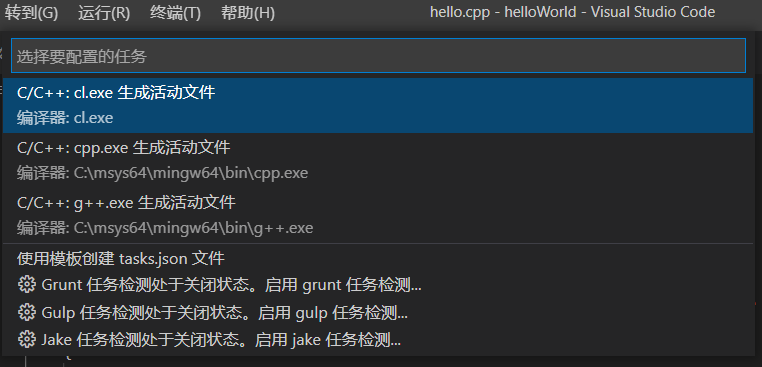

​		2. 这将在 .vscode 文件夹中创建一个 tasks.json 文件并在编辑器中打开它。

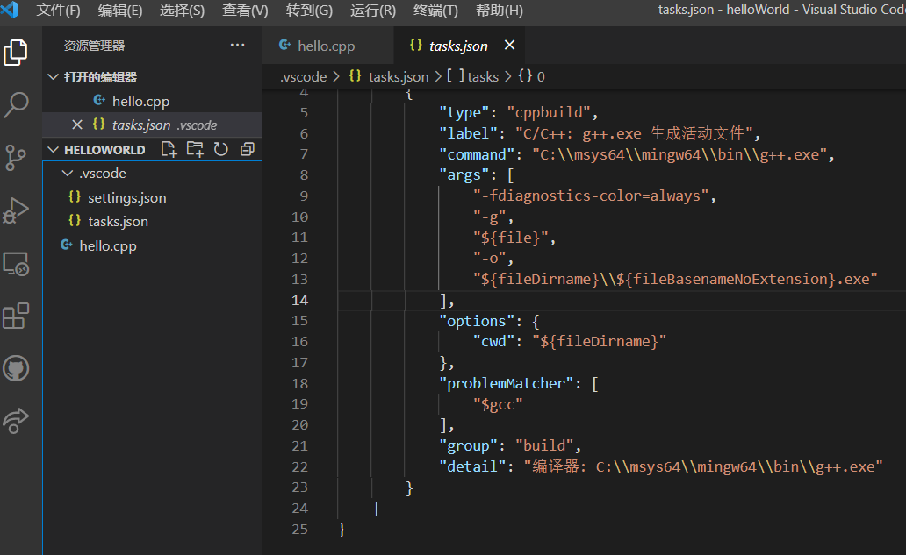

​		可以在group参数修改一下命令，改动如下。加入的"isDefault": true，这个为true就可以使用快捷键 Ctrl+Shift+B 运行此任务，如果为false，在菜单栏找终端运行也可以，就是为了方便用的。

```json
"group": {
    "kind": "build",
    "isDefault": true
},
```

​		3. 回到hello.cpp文件，按快捷键 Ctrl+Shift+B，就会生成hello.exe可执行文件。

​		使用 + 按钮创建一个新终端，您将拥有一个以 helloworld 文件夹作为工作目录的新终端。 运行 dir，您现在应该会看到可执行文件 helloworld.exe

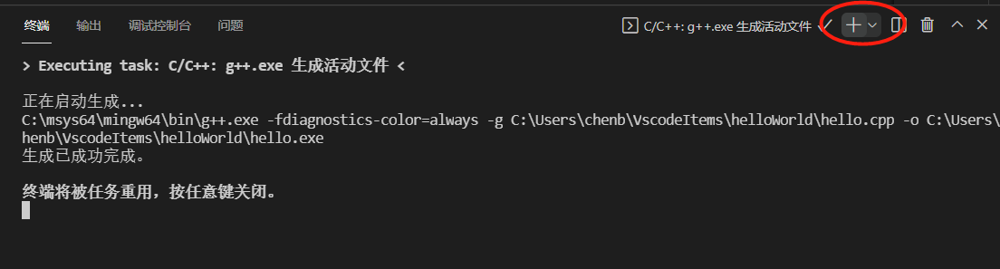

​		4. 然后通过键入 helloworld.exe（或 .\helloworld.exe，如果使用 PowerShell 终端）在终端中运行 helloworld，可以看出2种方式运行都可以打印容器信息。

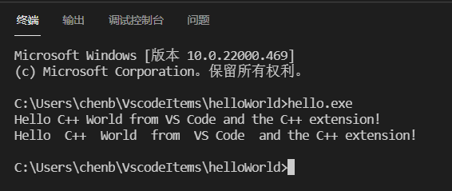

​		5. 还可以修改 tasks.json 的args参数，使用"${workspaceFolder}\\*.cpp"之类的参数而不是 ${file} 来构建多个 C++ 文件。 这将在当前文件夹中构建所有 cpp 文件。 还可以通过将"${fileDirname}\\${fileBasenameNoExtension}.exe"替换为硬编码文件名（例如"${workspaceFolder}\\myProgram.exe"）来修改输出文件名。

```json
"args": [
    "-fdiagnostics-color=always",
    "-g",
    "${workspaceFolder}\\*.cpp", // ${file},可以构建多个cpp文件而不是单个
    "-o",
    "${fileDirname}\\${fileBasenameNoExtension}.exe" // ${workspaceFolder}\\myProgram.exe 可以替换为硬编码名
],
```

​		完整的tasks.json文件如下。

```json
{
    "version": "2.0.0",
    "tasks": [
        {
            "type": "cppbuild",
            "label": "C/C++: g++.exe 生成活动文件",
            "command": "C:\\msys64\\mingw64\\bin\\g++.exe",
            "args": [
                "-fdiagnostics-color=always",
                "-g",
                "${workspaceFolder}\\*.cpp", // ${file},可以构建多个cpp文件而不是单个
                "-o",
                "${fileDirname}\\${fileBasenameNoExtension}.exe" // ${workspaceFolder}\\myProgram.exe 可以替换为硬编码名
            ],
            "options": {
                "cwd": "${fileDirname}"
            },
            "problemMatcher": [
                "$gcc"
            ],
            "group": {
                "kind": "build",
                "isDefault": true
            },
            "detail": "编译器: C:\\msys64\\mingw64\\bin\\g++.exe"
        }
    ]
}
```

#### 2.2.3.3 配置launch.json文件进行debug

​		接下来，可以创建一个 launch.json 文件来配置 VS Code，以便在按 F5 调试程序时启动 GDB 调试器。从菜单栏中，选择运行 > 添加配置，然后选择 C++ (GDB/LLDB)，就会自动创建 launch.json 文件。

​		program参数用于设置指定要调试的程序。 这里它设置为活动文件夹 ${fileDirname} 和活动文件名，扩展名为 .exe 为 ${fileBasenameNoExtension}.exe，如果 helloworld.cpp 是活动文件，则活动文件将是 helloworld.exe。

​		默认情况下，C++ 扩展不会向您的源代码添加任何断点，并且 stopAtEntry 值设置为 false。将 stopAtEntry 值更改为 true 以使调试器在您开始调试时停止在 main 方法上。

​		miDebuggerPath参数设置调试器gdb所在的路径，这里是C:\\msys64\\mingw64\\bin\\gdb.exe。

​		注意：preLaunchTask 设置用于指定要在启动前执行的任务。 确保它与 tasks.json 文件的label参数设置一致。

```json
{
    // 使用 IntelliSense 了解相关属性。 
    // 悬停以查看现有属性的描述。
    // 欲了解更多信息，请访问: https://go.microsoft.com/fwlink/?linkid=830387
    "version": "0.2.0",
    "configurations": [
        {
            "name": "(gdb) 启动",
            "type": "cppdbg",
            "request": "launch",
            "program": "${fileDirname}\\${fileBasenameNoExtension}.exe", // 输入程序名称，例如 ${workspaceFolder}/a.exe
            "args": [],
            "stopAtEntry": false,
            "cwd": "${fileDirname}",
            "environment": [],
            "externalConsole": false,
            "MIMode": "gdb",
            "miDebuggerPath": "C:\\msys64\\mingw64\\bin\\gdb.exe", // /path/to/gdb
            "setupCommands": [
                {
                    "description": "为 gdb 启用整齐打印",
                    "text": "-enable-pretty-printing",
                    "ignoreFailures": true
                }
            ],
            "preLaunchTask": "C/C++: g++.exe 生成活动文件" // 这里要添加1句,和task.json的label参数一样
        }
    ]
}
```

​		回到hello.cpp文件，首先设置断点，然后按 F5 或从主菜单中选择运行>开始调试。调试界面如下，调试语句会高亮。

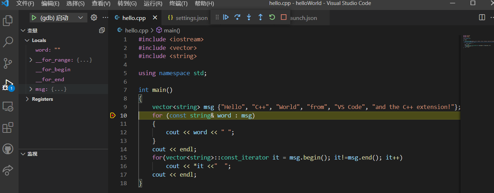

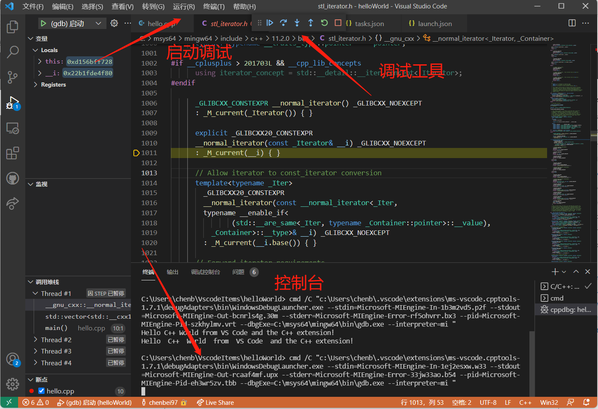

#### 2.2.3.4 配置c_cpp_properties.json文件调整编译标准

​		可以通过从命令面板 (Ctrl+Shift+P) 运行命令 C/C++：编辑配置 (UI) 来查看 C/C++ 配置 UI。例如可以配置编译器路径、IntelliSense 模式、C++ 标准和一些高级设置。

​		只需要调整C++ 标准为20或者17即可，其他可以默认不变，这样就会自动生成c_cpp_properties.json文件。

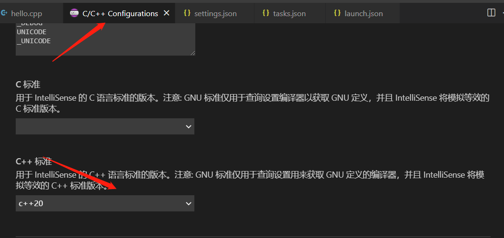

​		注意，和C:/msys64/mingw64/bin/g++.exe对应的intelliSenseMode应该是windows-gcc-x64

```c++
{
    "configurations": [
        {
            "name": "Win32",
            "includePath": [
                "${workspaceFolder}/**"
            ],
            "defines": [
                "_DEBUG",
                "UNICODE",
                "_UNICODE"
            ],
            "windowsSdkVersion": "10.0.19041.0",
            "compilerPath": "C:/msys64/mingw64/bin/g++.exe",
            "intelliSenseMode": "windows-gcc-x64",
            "cppStandard": "c++20"
        }
    ],
    "version": 4
}
```

​		如果安装过visualStudio，默认使用的就是它的编译器路径，与之兼容的intelliSenseMode应该是：windows-msvc-x64。

```cmake
C:/Program Files (x86)/Microsoft Visual Studio/2019/Professional/VC/Tools/MSVC/14.29.30133/bin/Hostx64/x64/cl.exe

"intelliSenseMode":"windows-msvc-x64"
```

### 2.2.4 其它

#### 2.2.4.1 快捷键

​		Ctrl+Shift+P：打开搜索拓展路径栏

​		Ctrl+Shift+B：build cpp文件

​		Ctrl+Shift+X：打开市场下载拓展

#### 2.2.4.2 滚轮调整字体大小

​		文件->首选项->设置，找到字体，点击在settings.json文件编辑，输入"editor.mouseWheelZoom": true即可。注意这个settings.json文件并不是.vscode里边的settings.json文件，两个文件路径不同。

```cmake
C:\Users\chenb\AppData\Roaming\Code\User\settings.json

C:\Users\chenb\VscodeItems\helloWorld\.vscode\settings.json
```

​		settings.json文件如下。

```json
{
    "files.autoGuessEncoding": true,
    "python.analysis.diagnosticPublishDelay": 100,
    "editor.fontFamily": "Consolas, 'Times New Roman', monospace",
    "files.autoSave": "onFocusChange",
    "kite.showWelcomeNotificationOnStartup": false,
    "explorer.confirmDelete": false,
    "C_Cpp.clang_format_sortIncludes": true,
    "C_Cpp.default.cppStandard": "c++20",
    "C_Cpp.default.cStandard": "c11",
    "C_Cpp.clang_format_fallbackStyle": "{BaseOnStyle:LLVM,UseTab:Never,IndentWidth:4}",
    "debug.onTaskErrors": "showErrors",
    "C_Cpp.updateChannel": "Insiders",
    "terminal.integrated.shell.windows": "C:\\WINDOWS\\System32\\cmd.exe",
    "terminal.explorerKind": "external",
    "editor.fontSize": 18,
    "editor.mouseWheelZoom": true,
}
```

## 2.3 配置Python

​		配置过程参考网址：[Get Started Tutorial for Python in Visual Studio Code](https://code.visualstudio.com/docs/python/python-tutorial)

### 2.3.1 下载拓展

​		Ctrl+Shift+X快捷键，搜索python下载扩展。注意如果已经下载过python，无需再安装，也就省去了python的环境变量配置步骤，直接选择解释器即可。

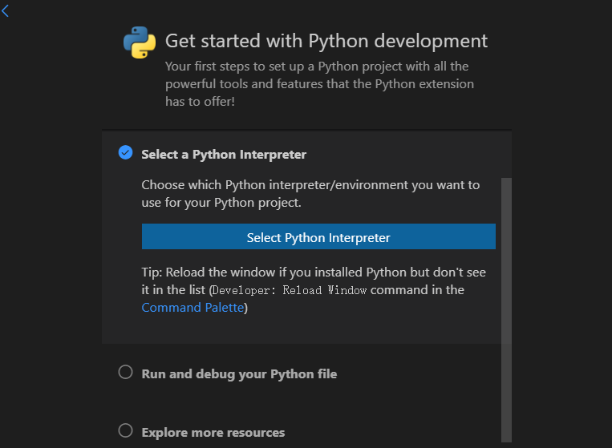

​		如果没有自动配置解释器路径，可以ctrl+shift+p，输入Python：Select Interpreter

### 2.3.2 验证配置是否成功

#### 2.3.2.1 配置文件夹为工作区

​		类似的操作，这里直接新建好了文件夹，首先cd到路径，code .就可以使用vscode打开这个文件夹了。或者直接在编辑器的菜单栏-文件打开文件夹也可以。code.是下载vscode的时候有个启动文件code.exe，属于vscode加到环境变量的一个命令。

```bash
cd C:\Users\chenb\VscodeItems\helloPython
type nul> hello.py
code .
```

#### 2.3.2.2 选择解释器

​		Python 是一种解释型语言，为了运行 Python 代码并获得 Python IntelliSense，必须告诉 VS Code 使用哪个解释器。在 VS Code 中，通过打开命令面板 (Ctrl+Shift+P) 选择 Python 3 解释器，开始输入 Python：选择要搜索的解释器命令，然后选择命令。 如果可用，您还可以使用状态栏上的 Select Python Environment 选项（它也可能已经显示了选定的解释器）。

​		解释器这里有推荐的解释器，是MSYS2的解释器，3.9版本。

```shell
C:\msys64\mingw64\bin\python.exe
```

​		也可以使用以前安装过的解释器，会自动检测路径。

```
C:\Users\chenb\AppData\Local\Programs\Python\Python37\python.exe
```

​		新建hello.py文件，键入以下代码，直接运行即可。

```c++
import numpy as np
import matplotlib.pyplot as plt
print("hello Python!")
x = np.linspace(-np.pi,np.pi,1000)
y = np.cos(x)
plt.plot(x,y,"r-o",label="y=cos(x)")
plt.legend(loc="upper right")
plt.title("hello Python")
plt.show()
```

#### 2.3.2.3 创建虚拟环境

​		终端键入命令，会弹出窗口询问是否在这个工作区使用这个虚拟环境，点击确定。

```python
py -3 -m venv .venv
.venv\scripts\activate
```

​		此时上述代码就会提示import numpy as np和import matplotlib.pyplot as plt导入存在问题，因为虚拟环境没有这两个包。

​		继续在终端执行命令python -m pip install matplotlib和python -m pip install numpy，安装matplotlib会自动安装numpy。

```python
# macOS
python3 -m pip install matplotlib

# Windows (may require elevation)
python -m pip install matplotlib

# Linux (Debian)
apt-get install python3-tk
python3 -m pip install matplotlib
```

​		可能会提示升级pip，键入如下命令即可。

```python
python -m pip install --upgrade pip
```

​		安装完毕以后切换解释器路径为. \ . venv \ Scripts \ python.exe （ctrl+shift+p自动显示，或者输入Python：Select Interpreter）就可以再次运行上述代码了，不过要注意多个虚拟环境会大量占用磁盘存储，如果无需隔离环境就使用公用的解释器路径即可。

​		完成后，在终端窗口中键入 deactivate 以停用虚拟环境。