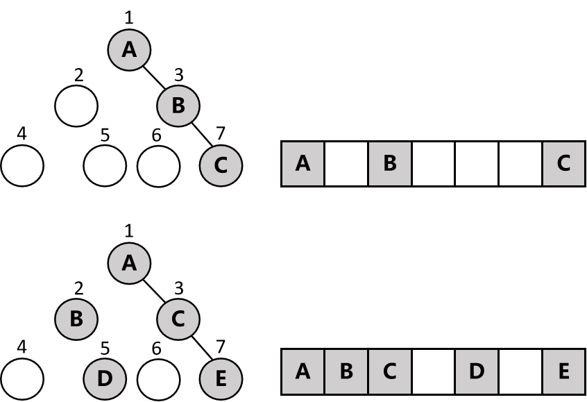
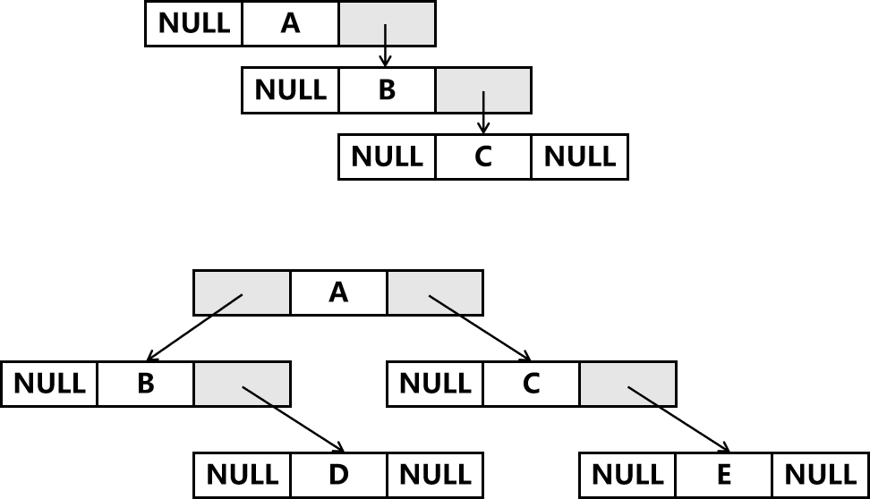
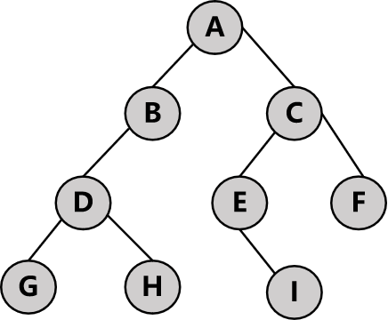

## 概述

​		树分为一般树和二叉树。本章介绍的二叉树是后续章节的树的基础，如堆、左高树、二叉搜索树、AVL树、红黑树等。关于二叉树需要了解一些术语，如高度、深度、层、根、叶子、孩子、双亲和兄弟。

​		还要了解数组和链表实现的二叉树，以及常见的二叉树遍历方法，前序遍历、中序遍历、后序遍历和层次遍历。

## 11.1 树

### 11.1.1 一般树

#### 11.1.1.1 根、子树和叶子

​		定义：一棵树T是一个非空的有限元素的集合，其中1个元素为根，其余的元素如果存在的话都是组成根的子树。根是层次数据中最高层的元素，它的直接下一级元素是子树的根，根与子树的根有一条边。

​		每一棵子树都是根在上，子树在下。每个元素代表1个节点，一个元素节点总是和其孩子节点之间用边相连。

​		没有子节点的节点叫叶子，没有父母的节点只有唯一一个，即树根。

#### 11.1.1.2 级与度

​		树的另一常用术语为级(level)，树根是1级，孩子为2级，以此类推。

​		树的高度(height)或者深度(depth)是树中级的个数。

​		度是针对元素节点来说的，某个节点的度是指其孩子的个数，所以叶节点的度是0。一般的，一颗树的度是指元素的度的最大值。

### 11.1.2 二叉树

#### 11.1.2.1 定义

​		一颗二叉树(binary tree)t是有限个元素的集合(可以为空)。二叉树非空时，1个元素为根，余下的元素(存在的话)可以划分为2棵二叉树，分别称为t的左子树和右子树。

#### 11.1.2.2 与一般树的区别

​		二叉树每个节点都有2个子节点(其中1个或2个可能为空)，也就是子节点都最多有2个非空子节点。而树的节点可以有超过2个的子节点，没有限制。

​		二叉树的每个节点的子节点都是有序的，有左子树和右子树之分。树的子树是无序的。

​		二叉树可以为空(与定义有关)，树不能为空。

#### 11.1.2.3 特性

​		**1. 二叉树有n>0个元素，那么它有n-1条边。**

​		**2. 二叉树的高度为h≥0，则它最少有h个元素，最多有2^h-1个元素**。注意：根是元素，所以h=0时，说明根也没有，是空树。

​		记第i级元素均不为空时的个数为s[i]，那么有

​		s[0] = 0, h = 0;

​		s[1] = 1 ,  h = 1 ;

​		s[2] = 2 ,  h = 2 ;

​		s[3] = 4 ,  h = 3 ;

​		...

​		s[i] = 2^(i-1),  h = i ;

​		那么元素总数为s[1]+s[2]+...s[h]=1+2+4+..2^(h-1) = (1-2^h)/(1-2) = 2^h - 1

​		等比数列求和公式：

​		a1+a2+..an = a1(1-q^n)/(1-q)，q≠1

​		a0+a1+..an-1 = a0(1-q^n-1)/(1-q)，q≠1

​		故

​		1+2+4+...2^n = (1-2^n)/(1-2)=2^n-1

​		2+4+...2^n = 2(1-2^n)/(1-2) = 2^(n+1)-2

​		**3. 如果一颗二叉树有n>0个元素，则树的最大高度为n，最小高度为[log2(n+1)]。**

​		因为每层最少1个元素，n个元素最多n层；而总的元素最多为2^h-1个，故n≤2^h-1，那么h≥log2(n+1)，因为h是整数，所以取整。例如n=15，则h最少为4，n=14时，log2(15)=3.9，取整h还是最少4。

​		**4. 高度h的二叉树恰好有2^h-1个元素时称为满二叉树。**

​		对满二叉树从第1层到最后1层开始编号，编号顺序为1~2^h-1，从中任意删除k个编号为2^h-i(1≤i≤k)的元素，k∈[1,2^h)，得到的二叉树叫做完全二叉树，满二叉树是完全二叉树的1个特例。

​		**5. 有n个元素的完全二叉树。其高度为[log2(n+1)]。**		

​		6. 完全二叉树的某个元素编号i满足1≤i≤n，则以下关系成立：

​			1) **i=1，则该元素为二叉树的根。如果i>1，则其父节点的编号必定是[i/2]**，注意这里是>0.5才进1，例如7/2=3.5但是取整为3。

​			2) **如果2i>n，则该元素没有左子树，否则左子树编号为2i；如果2i+1>n，则该元素没有右子树，否则右子树编号为2i+1**。

​		例如h=4的满二叉树如图所示，那么n=15。


​		编号13，其父节点为[13/2]=6，且12×2和12×2+1都大于15，所以没有左子树和右子树。

​		编号7，其父节点为[7/2]=3，且7×2与7×2+1均不大于15，所以有左子树14和右子树15。

​		如果删除k=5个元素，要删除的元素必须是从后往前的5个元素，即2^4-i=15,14,13,12,11，此时n=11。

​		再看编号7，其父节点为[7/2]=3不变，7×2>11，所以没有左子树和右子树。

​		而编号5，2×5<11，2×5+1≯11，所以编号5有左子树2×5=10但没有右子树。

## 11.2 二叉树的描述

### 11.2.1 数组描述

​		数组描述方法容易浪费空间，按照从1到2^h-1的编号顺序对每个节点编好号之后，将节点编号映射到1维数组的对应位置即可。

例如具有3个和5个元素的不完全二叉树，其映射关系如下图所示。



​		如果是少量元素的树，数组描述还是比较合理的，n个元素的二叉树可能需要最多2^n个空间来存储，数组0下标也算1个。但是最坏的情况是右斜树，会造成极大的空间浪费。例如只有4个元素的右斜树，但是数组却需要16个空间，因为第4个元素在下标15的位置。

### 11.2.2 链表描述

​		二叉树的节点具备什么样的特性呢？它首先有个数据域用于存储数据，还要2个指针域，用于指向左子树和右子树节点。这种节点的C++实现如下所示，其名称为binaryTreeNode，代码给出了3个构造函数。

​		注意：使用了：在调用构造函数之前就初始化了变量data

```c++
template<class T>
struct binaryTreeNode
{
	T data;
	
	binaryTreeNode<T>* leftChild, // 左子树
									* rightChild; // 右子树
	// 默认构造
	binaryTreeNode() { leftChild = nullptr; rightChild = nullptr; }
	// 初始化数据域的构造
	binaryTreeNode(const T& theData):data(theData)
	{
		leftChild = rightChild = nullptr;
	}
	// 初始化数据域和指针域的构造
	binaryTreeNode(const T& theData, 
		binaryTreeNode* theLeftChild, 
		binaryTreeNode* theRightChild):data(theData)
	{
		leftChild = theLeftChild;
		rightChild = theRightChild;
	}
};
```

​		如果有了这样的节点描述，对于[11.2.1 数组描述](#11.2.1 数组描述)的图可用这样的示意图表示。



​		因为n个元素的二叉树有n-1个边，n-1个边恰好是n-1个指针，而共有2n个指针，所以有2n-(n-1)=n+1个指针是空指针未被初始化。相比于数组描述，空指针占据的内存小了很多。

### 11.2.3 基本操作

​		一棵二叉树具备的操作有：

​		确定树的高度；

​		确定树的元素数目；

​		复制二叉树；

​		显式或者打印二叉树；

​		确定两颗二叉树是否一致；

​		删除整棵树；

​		这些操作都可以通过有步骤的遍历二叉树来完成，遍历过程中每个元素仅被访问一次。访问1个元素就可以对该元素进行一些操作，例如显式或打印该元素、计算以该元素为根的子树所表示的数学表达式、对二叉树的元素个数+1等。

### 11.2.4 遍历方式

​		遍历常用的方式有4种，前序遍历、中序遍历、后序遍历和层次遍历。

​		以下图例子说明。



​		前序遍历：A  B  D  G  H  C  E  I  F，特点是父(根)节点在左子树节点之前，左子树节点在右子树节点之前。

​		遍历过程为：ABC->ABDC->ABDGHC->ABDGHCEF->ABDGHCEIF。

​		父节点A放在BC之前，然后从B开始，B应放在D之前，继续D放在GH之前，左子树遍历结束；然后C应放在EF之前，E放在I之前。

​		C++代码如下。

```c++
void binaryTree_preOrder(binaryTreeNode<string>* root)
{
	if (root != NULL)
	{
		// 前序递归遍历
		printTreeNode(root); // 先访问父(根)节点
		binaryTree_preOrder(root->leftChild); // 再访问左子树节点
		binaryTree_preOrder(root->rightChild); // 最后访问右子树节点
	}
}
```

​		中序遍历：G  D  H  B  A  I  E  C  F，特点是左子树节点在父节点之前，父节点在右子树节点之前。

​		遍历过程为：BAC->DBAC->GDHBAC->GDHBAECF->GDHBAIECF

​		左子树节点B在A前，然后G也要在D之前，就形成了GDHBAC，左子树遍历结束；然后E在C前边，I在E前边。

​		C++代码如下。

```c++
void binaryTree_inOrder(binaryTreeNode<string>* root)
{
	if (root != NULL)
	{
		// 中序递归遍历
		binaryTree_inOrder(root->leftChild); // 先访问左子树节点
		printTreeNode(root); // 再访问父(根)节点
		binaryTree_inOrder(root->rightChild); // 最后访问右子树节点
	}
}
```

​		后序遍历：G  H  D  B  I  E  F  C  A，特点是父(根)节点在最后，左子树节点在最前，右子树节点在中间。

​		遍历过程为：BCA->DBCA->GHDBCA->GHDBEFCA->GHDBIEFCA

​		父(根)节点A在C后，然后B在D后，D在GH后，左子树遍历结束；然后C在EF后，E在I后。

​		C++代码如下。

```c++
void binaryTree_postOrder(binaryTreeNode<string>* root)
{
	if (root != NULL)
	{
		// 后序递归遍历
		binaryTree_postOrder(root->leftChild); // 先访问左子树节点
		binaryTree_postOrder(root->rightChild); // 再访问右子树节点
		printTreeNode(root); // 最后访问父(根)节点
	}
}
```

​		以上代码的实现，可以看成是压栈的过程，也就是先入后出。先访问的节点先打印，后访问的节点先压栈。以先序遍历为例进行分析：root首先进入是A的地址，**打印A**，然后访问A的左子树B，访问A的右子树C的进程先被挂起相当于压栈；**打印B**，然后进入下一次递归，访问C的进程依然是挂起的；继续下一次递归，进入B的左子树D，右子树其实是NULL但是也是先被挂起，继续压栈；**打印D**，然后进入D的左子树G，**打印G**，H被挂起，压栈；因为G没有子树，所以执行挂起的H进程，出栈，**打印H**，再执行挂起的C进程，出栈，**打印C**；进入C的左子树E，**打印E**，C的右子树F进程先被挂起，压栈；进入E的左子树I，**打印I**；然后再回过头执行挂起的F进程，出栈，**打印F**。

​		也即是A  B  D  G  H  C  E  I  F

​		层次遍历：A  B  C  D  E  F  G  H  I

​		层次遍历是从顶层到底层，同一层中从左到右依次访问数的元素，这需要队列结构而不是栈，所以层的访问需要引入队列的实现。

​		C++代码如下。

​		实现过程说明：首先A进入，**打印A**，依次存放A的子树B、C入列；更新root为队列的开头，也就是B用于下一次打印，然后删除队列的B（所以过程是先更新root记录队首用于下次打印，再删除队列的队首）；**打印B**，因为B有子树D，D入列，此时队列有CD，让root等于C，删除队列的C；**打印C**，C有子树E、F，入列，队列为DEF，更新root为D，并删除队列的D；**打印D**，D有子树G、H，入列，此时队列EFGH，更新root为E；**打印E**，E没有子树，删除队列的E，更新root为F；类似的，**打印F、G**，继续删除队列的F、G；此时队列还有H，更新root为H，删除队列的H，**打印H**，H有子树I，入列；队列依然只有1个元素I，更新root为I，删除队列的I，**打印I**，I无子树，队列也为空，尝试更新root不成功返回，程序结束。

```c++
void binaryTree_levelOrder(binaryTreeNode<string>* root)
{
	arrayQueueSimple<binaryTreeNode<string>*> q; // 树节点的队列,存的是树节点指针
	while (root != NULL)
	{
		// 打印上一次更新后的root
		printTreeNode(root); // A
		if (root->leftChild != NULL) // root的2个子树存到队列
			q.push(root->leftChild); // B
		if (root->rightChild != NULL)
			q.push(root->rightChild); // C 

		try
		{
			root = q.front(); // update root = B
		}
		catch (queueEmpty)
		{
			return;
		}
		q.pop(); // 删除q中的B,=>printTreeNode(root); print root=B
	}
}
```

​		测试代码和printTreeNode函数代码如下。

```c++
binaryTreeNode<string> A("A");
binaryTreeNode<string> B("B"); 
binaryTreeNode<string> C("C");
binaryTreeNode<string> D("D");
binaryTreeNode<string> E("E");
binaryTreeNode<string> F("F");
binaryTreeNode<string> G("G");
binaryTreeNode<string> H("H");
binaryTreeNode<string> I("I");
A.leftChild = &B; A.rightChild = &C;
B.leftChild = &D; 
C.leftChild = &E; C.rightChild = &F;
D.leftChild = &G; D.rightChild = &H;
E.leftChild = &I;

cout << "前序遍历：\n";
binaryTreeNode<string>* p_preOrder = &A;
binaryTree_preOrder(p_preOrder);

cout << "\n中序遍历：\n";
binaryTreeNode<string>*  p_inOrder = &A;
binaryTree_inOrder(p_inOrder);

cout << "\n后序遍历：\n";
binaryTreeNode<string>* p_postOrder = &A;
binaryTree_postOrder(p_postOrder);

cout << "\n层次遍历：\n";
binaryTreeNode<string>* p_levelOrder = &A;
binaryTree_levelOrder(p_levelOrder);

cout << "\n";

void printTreeNode(binaryTreeNode<string>* node)
{
	cout << node->data << "  ";
}
```

### 11.2.5 抽象数据类型

​		分析完遍历方式后，再来分析抽象数据类型。然后利用上述测试过的遍历代码，将其集成到抽象数据类型的具体类实现即可。

​		

