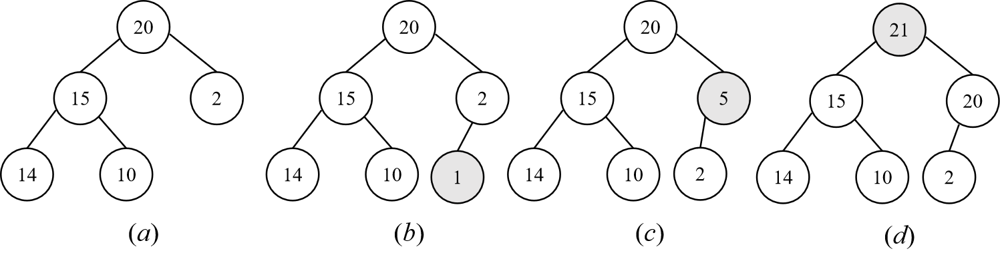
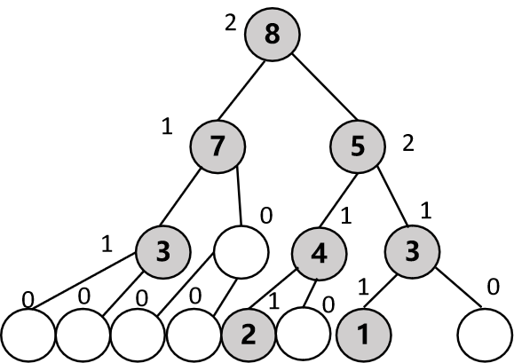

## 概述

​		与普通的队列不同，优先级队列元素出队列的顺序由优先级确定，可以按照优先级的递增也可以递减来出队列，但是不按照元素进入队列的顺序。

​		实现优先级队列通过堆实现，**<u>堆是一颗完全二叉树</u>**，用数组描述的堆效率最高；

​		链表结构描述的左高树也可以表示优先级队列；

​		此外还有配对堆、双端优先级队列，均可以在本书网站找到。C++的STL类priority-queue便是用堆实现的优先级队列。

​		堆的概念可以引出堆排序，其时间复杂度为O(nlogn)，第2章的计数排序、选择排序、冒泡排序、插入排序时间复杂度都是O(n^2)，第6章的基数排序、箱子排序是O(n)，不过这两类排序要求元素的取值限制在合适的范围，通用性不高。

​		堆排序是迄今为止，第一种通用性排序算法，可以证明，任何依赖**<u>成对元素</u>**比较的通用排序算法都具备O(nlogn)时间复杂度。

​		优先级队列是0个或多个元素的集合，每个元素都有一个优先权值，主要的操作有查找1个元素，插入1个元素和删除1个元素，对应top、push和pop函数。

​		最小优先级队列，查找和删除的元素都是优先级最小的元素，最大优先级队列查找和删除的元素是优先级最大的元素。元素允许有相同的优先级，这样的元素查找和删除可以按照任意顺序进行处理。

​		优先级队列的应用例子：

​		如果一台机器每次提供某种服务的收费是相同的，不同用户花费的时间不同，便可以将用户的时间按照最小优先级队列进行排队，即花费时间最少的优先提供服务以取得收益最大化；或者机器每次提供服务的时间相同，但是收费不同，那么花费最多的客户优先，这就是最大优先级队列。

​		优先级队列可以通过数组、堆来实现。数组可以是有序的也可以是无序的。无序数组，是插入很省事，但是删除不省事，删除的时候需要遍历数组找到最大的那个数据，然后删除需要执行覆盖操作。有序数组正好相反，删除很省事，因为只需要删除数组最后1个元素即可，析构这个元素也很简单，插入的话就需要遍历找到插入的位置，按序插入。

​		不过，除了使用数组，使用堆其实是效率最高的。不过堆本质上也是使用数组存储数据，只是它根据大根堆或者小根堆的定义，每次插入元素时，插入到数组符合映射关系的位置，删除的时候也要从这个节点往后的子树重新按照根队定义来移动。STL中的类priority_queue使用了基于向量的堆来实现大根堆，它允许用户自定义优先级的比较函数，因此这个类也可以实现小根堆。

## 12.1 抽象数据类型

### 12.1.1 最大优先级队列

​		语言描述如下。

```c++
抽象数据类型 maxPriorityQueue
{
    实例
        有限个元素集合，每个元素都有优先级
    操作
        empty()：队列为空返回true
        size()：返回队列元素个数
        top()：返回优先级最大元素
        pop()：删除优先级最大元素
        push(x)：插入元素x
}
```

​		C++代码实现如下。

```c++
template<class T>
class abstractMaxPriorityQueue
{
public:
    virtual ~abstractMaxPriorityQueue() {}
    virtual bool empty() const = 0;
    virtual int size() const = 0;
    virtual const T& top() = 0;
    virtual void pop() = 0;
    virtual void push(const T& theElement) = 0;
};
```

### 12.1.2 最小优先级队列

​		语言描述如下。

```c++
抽象数据类型 maxPriorityQueue
{
    实例
        有限个元素集合，每个元素都有优先级
    操作
        empty()：队列为空返回true
        size()：返回队列元素个数
        top()：返回优先级最小元素
        pop()：删除优先级最小元素
        push(x)：插入元素x
}
```

​		C++代码实现如下。

```c++
template<class T>
class abstractMinPriorityQueue
{
public:
    virtual ~minPriorityQueue() {}
    virtual bool empty() const = 0;
    virtual int size() const = 0;
    virtual const T& top() = 0;
    virtual void pop() = 0;
    virtual void push(const T& theElement) = 0;
};
```

## 12.2 无序数组实现的最大优先级队列

​			最大最小思路是差不多的，这里只给出最大优先级队列的无序数组实现。

​			无序数组的实现，插入操作时间复杂度O(1)，即queue[queueSize]=element，但是删除操作为O(n)。首先要找到权重最大的那个元素，然后返回这个元素在该数组的索引，然后使用copy操作复制index前后的两段数据。

​			有序数组的实现，删除变得容易，因为删除queue[queueSize]即可，插入操作为O(n)，需要找到合适的索引位置，然后插入。

### 12.2.1 声明

​			C++声明如下，有几个自定义的函数，outputByWeight和getCapacity()。weightNode< T >类型的数据来存储。

​			注意继承的时候要在抽象类型这里，使用weightNode< T >去继承，这样maxPriorityQueue的对象才能够插入weightNode类型的元素，以及返回这样类型的元素。

```c++
template<class T>
class maxPriorityQueue :public abstractMaxPriorityQueue<weightNode<T>>
{
public:
	maxPriorityQueue(int theCapacity);
	~maxPriorityQueue();
	bool empty() const { return queueSize == 0; }
	int size() const { return queueSize; }
	int getCapacity() const { return capacity; }
	const weightNode<T>& top();
	void pop();
	void push(const weightNode<T>& theElement);
	void outputByWeight(ostream&) const;
	friend ostream& operator<<<>(ostream& out, const maxPriorityQueue<T>&);
protected:
	int queueSize;
	int capacity;
	int getMaxWeightIndex();
	weightNode<T> * data;
};
```

### 12.2.2 实现

​		构造和析构函数。

```c++
template<class T>
maxPriorityQueue<T>::maxPriorityQueue(int theCapacity)
{
	capacity = theCapacity;
	data = new weightNode<T>[capacity];
	queueSize = 0;
}

template<class T>
maxPriorityQueue<T>::~maxPriorityQueue()
{
	if (data != NULL)
	{
		delete[] data;
		data = NULL;
		delete data;
	}
}
```

​		查找、删除和插入函数。

```c++
template<class T>
void maxPriorityQueue<T> ::push(const weightNode<T>& theElement)
{
	if (queueSize == capacity)
	{
		weightNode<T>* temp = new weightNode<T>[capacity * 2];
		copy(data, data + queueSize, temp);
		delete[] data;
		capacity *= 2;
		data = temp;
	}
	data[queueSize] = theElement;
	queueSize++;
}

template<class T>
void  maxPriorityQueue<T> ::pop()
{
	if (queueSize == 0)
		throw queueEmpty();
	weightNode<T>* temp = new weightNode<T> [capacity]; // 这里容量不要变
	int index = getMaxWeightIndex();
	copy(data, data + index, temp);
	copy(data + index + 1, data + queueSize, temp + index);
	delete[] data;
	data = temp;
	queueSize--;
}

template<class T>
const weightNode<T>& maxPriorityQueue<T> ::top()
{
	if (queueSize == 0)
		throw queueEmpty();
	return data[getMaxWeightIndex()];
}
```

​		私有函数，为了找到最大优先级元素在数组的位置。

```c++
template<class T>
int maxPriorityQueue<T> ::getMaxWeightIndex()
{
	double maxWeight = data[0].weight;
	int index = 0;
	for (int i = 1; i < queueSize; i++)
	{
		if (data[i].weight > maxWeight)
		{
			maxWeight = data[i].weight; // 如果权重一样,返回的是先入队列的那个元素
			index = i;
		}
	}
	//cout << "the index is " << index << endl;
	return index; // 返回最大权重元素所在位置
}
```

​		输出优先级队列的函数。

```c++
template<class T>
void maxPriorityQueue<T> ::outputByWeight(ostream& out) const
{
	if (queueSize == 0)
	{
		out << "the queue is empty!" ;
		return;
	}
	int count = 0;
	int* rank = new int[queueSize]; // rank用于得到名次
	for (int i = 0; i < queueSize; i++)
		rank[i] = 0; // 名次先全部初始化为0
	for (int i = 1; i < queueSize; i++)
		for (int j = 0; j < i; j++)
		{
			count++;
			if (data[j].weight <= data[i].weight) rank[i]++;
			else rank[j]++;
		} // 名次排序得到依据权重的排名
	cout << "size is " << queueSize << endl;
	weightNode<T>* temp = new weightNode<T>[queueSize]; // temp用于存放排序后的data
	for (int i = 0; i < queueSize; i++)
	{
		temp[rank[i]] = data[i]; // rank[i]是a[i]被移动的新位置
	}
	// 名次是升序的
	for (int i = queueSize-1; i >= 0; i--)
		out << temp[i]; // 从大到小输出
	delete[] temp;
}

template<class T>
ostream& operator<<<>(ostream& out, const maxPriorityQueue<T>& x)
{
	x.outputByWeight(out);
	return out;
}
```

## 12.3  堆实现的最大优先级队列

​		相比于数组，无论是有序还是无序，堆实现更加高效，所以引入堆的概念。

### 12.3.1 堆的定义

​		定义1：一颗大根树/小根树

​		大根树的每个节点的值都大于(小于)或等于其子节点(如果有子节点的话)的值。也就是说，大根树和小根树都是二叉树，只是元素是有序的。注意有序是说，父节点到子节点的路径有序，兄弟节点之间不一定有序。

​		定义2：一个大根堆/小根堆

​		**<u>在大根树和小根树的定义下</u>**，加入一个还是完全二叉树的强条件，这就要求元素必须是按照编号顺序/层去铺满树，不能跳跃。

​		由于是完全二叉树，所以可以将二叉树的元素映射到一维数组，使用节点在数组中的位置来表示在堆中的位置。如根的位置在数组中的位置是1，左孩子为2，右孩子为3等等。

​		堆的高度满足完全二叉树的高度定义，即[log2(n+1)]，所以能够在O(height)时间内完成插入和删除操作，则这些操作的复杂性为O(logn)。

### 12.3.2 堆的插入、删除与初始化

​		以大根堆为例进行说明。

#### 12.3.2.1 插入

​		假如有一棵完全二叉树如(a)图所示，那么插入新元素为1、5和21的时候，其插入位置为(b)、(c)、(d)所示。



​		如果插入的元素是1，因为是完全二叉树，只需要在2的左子树创建新节点即可，按照数组编号arr[++heapSize]，因为heapSize=5，所以应当是arr[6]=1。

​		如果插入的元素是5，arr[6]=5，但是不满足大根堆的要求，所以沿着子节点到父节点直到根节点的路径，两两进行比较交换，也就是起泡过程，直到某个父节点的元素值大于新元素为止。首先arr[6]和arr[3]比较，arr[6]>arr[3]让arr[6]=arr[3]=2(这里不用让arr[3]再等于5，让它接着和arr[1]=20比)，然后再比较5和arr[1]，因为arr[1]=20>5，所以无需交换，这是再让arr[3]=5。因为大根堆沿着子-父路径已经是有序的过程，所以只需要1次起泡过程即可。

​		如果插入的元素是21，21>arr[3]=2，让arr[6]=2下移，然后21继续和arr[1]=20比，让arr[3]=20下移，此时循环结束arr[1]=21再进行赋值。

​		从以上分析可以看出，关键有2个。插入的时候，如果有必要，要拓展容量；其次，就是找到节点的父节点，然后比较，父节点编号总是子节点的编号一半，要使用整除2，从arr[++heapSize]/2开始往上每一个和新元素比较大小，满足条件才进行交换赋值，否则只是让父节点下移覆盖。

​		因为1次插入，是1个叶子到根的起泡过程，每层耗时O(1)，总耗时O(height)=O(logn)。

#### 12.3.2.2 删除

​		删除1个元素很简单，只需要heap[1].~T()即可，接下来的工作是将剩下的元素重新组织得到大根堆。注意，并不是简单的所有元素前移1个单位，映射关系会有变化，因为兄弟节点之间并不是有序的，只是父子节点有序，即不是完全的有序数组。

​		现在假如要删除(d)中的元素21。第1步heap[1].~T()；第2步用1个变量记录heap[heapSize--]，然后heap[heapSize--].~T()；第3步，选择新的根节点，只能从根节点的左右子树寻找，大的移动到根节点，即元素20移动到根节点；第4步，判断此时删除的元素能否插入到根节点子树腾出来的节点，因为删除的元素是2，可以移动到根节点的右子树，也就是编号3的位置，所以结束；如果不能插入，那么就进行第5步；第5步，比较根节点子树腾出来的节点的左右子树，找到符合条件的节点插入到这个腾出来的节点，这样就是腾出来的节点的左右子树存在空位，再判断删除的节点能否插入这个空位，相当于重复3、4步；返回执行，直到最后，必定有个位置可以插入，最坏的情况下是，所有元素都向前移动了1个编号，删除的节点插在了heap[heapSize-1]的位置。

​		因为删除的元素2，在第4步就成功了，所以最后得到的二叉树还是原来的(a)图。

​		现在假如要继续删除(a)中的元素20，目前还有5个元素。第1步删除heap[1]=20；第2步删除heap[5]=10，它被记录在临时变量；第3步，比较根节点的左右子树即15和2，则heap[1]=15；第4步，现在heap[2]空缺，比较10能否插入该空位，10有个比它大的14，所以这个空缺不能被10补入，执行第5步；找到空缺的编号也就是heap[2]的子树，即14，所以14填了原本15的位置，那么10就填入原本14的位置。

#### 12.3.2.3 初始化

​		除了通过反复push，还可以直接通过指定的优先级数组来初始化一个大根堆。直接让heap指向传递来的数组theHeap，更改heapSize为数组的元素个数(注意下标0不计入)，同时arrayLength也要更新为heapSize+1，否则会出现问题。

​		如何根据数组来映射到大根堆呢？

​		为了保证大根堆的定义，应当从最后一个具有叶子节点的根节点开始，对其子树进行检查。如果子树有大于根节点的元素，则进行交换，如果没有就不进行操作，这个过程和删除操作差不多，删除的元素应当插入哪个位置，需要先从根节点直到删除元素的根节点进行检查，然后找到合适的位置进行插入。

​		区别在于，初始化操作检查完1个根节点后，虽然它下边的子树满足了大根堆，但不意味着这些子树在其它根节点看来也是大根堆。所以进行循环，倒序循环，检查完低级的根节点再检查高级的根节点下方的子树是否是大根堆，直到全局根节点。

​		初始化，需要直到数组的size，size总是会满足和高度的对数关系，将size个元素按照大根堆的定义，从全局根节点开始向下填充，如果不够2^height-1个元素，倒数的位置为空节点。不会出现空节点在倒数第2层的情况，只会出现在大根堆的最后1层。

### 12.3.3 优先级队列maxHeap

#### 12.3.3.1 声明

​		声明如下，主要是4个函数，push、pop、initialize和top函数。

```c++
template<class T>
class maxHeap : public abstractMaxPriorityQueue<T>
{
public:
    maxHeap(int initialCapacity = 10);
    ~maxHeap();
    bool empty() const { return heapSize == 0; }
    int size() const{return heapSize;}
    int capacity() const { return arrayLength-1; } // 用户初始化的容量
    const T& top();
    void pop();
    void push(const T&);
    void initialize(T*, int);
    void deactivateArray();
    void output(ostream& out) const;
private:
    int heapSize;       // 堆节点的个数
    int arrayLength;    // 数组真实容量=初始化容量+1,因为heap[0]弃用
    T* heap;            // 存放元素的堆
};
```

#### 12.3.3.2 实现

​		push函数如下。

```c++
template<class T>
void maxHeap<T>::push(const T& theElement)
{
    if (heapSize == arrayLength - 1) // 实际用到的容量是arrayLength - 1
    { 
        
        T* temp = new T[2 * arrayLength-1];
        copy(heap, heap + arrayLength, temp); //heap[0,arrayLength)=>temp
        /*delete[] heap;*/
        heap = temp;
        arrayLength = 2 * arrayLength - 1;
        //changeLength1D(heap, arrayLength, 2 * arrayLength); // 用这个终端会输出一些错误信息不明白什么原因
        //arrayLength *= 2;
    }

    int currentNode = ++heapSize; // 插入的节点在数组的位置就是arr[++heapSize]
    while (currentNode != 1 && heap[currentNode / 2] < theElement) // 起泡过程
    {
        // 找到编号最大的1个父节点元素大于新元素即可
        // 如果父节点小于新元素heap[currentNode / 2] < theElement
        // 且父节点没到编号1根节点,就继续折半,使用&&是因为父节点不能无休止上寻
        // 且根节点元素也小于新元素,如果用或逻辑就无法退出循环了
        heap[currentNode] = heap[currentNode / 2]; // 让子节点等于父节点进行覆盖
        currentNode /= 2;                          // 父节点
    }

    heap[currentNode] = theElement; // 循环条件满足退出后才进行赋值
}
```

​		pop函数如下。

```c++
template<class T>
void maxHeap<T>::pop()
{
    if (heapSize == 0)   // heap empty
        throw queueEmpty();
    heap[1].~T(); // 第1步,最大优先级直接析构掉即可
    // 接下来的工作是将剩下的元素重新组织得到大根堆
    // 并不是简单的所有元素前移1个单位,映射关系会有变化
    // 因为兄弟节点之间并不是有序的,只是父子节点有序
    // 第2步:删除尾部元素,但是需要用变量临时记录一下
    T lastElement = heap[heapSize--];//但注意heap[heapSize]并没有删除
    heap[heapSize + 1] = NULL; // 删除其实删除不掉
    // 从根节点的左右子树开始比较
    int currentNode = 1,
        child = 2;     // 根节点的左孩子
    while (child <= heapSize) // 最后1个孩子节点是新的heapSize,也就是原来的heapSize-1
    {
        // 第3步从父(根)节点的子树选择更大的,也即是孩子可能平移到兄弟节点
        if (child < heapSize && heap[child] < heap[child + 1]) 
            // heap[2]<heap[3]=>heap[heapSize-1]<heap[heapSize]
            child++; // 例如,如果heap[2]<heap[3],说明右子树移动到父(根)节点

        // 第4步,判断删除的元素能否插入到这个空缺child的位置
        if (lastElement >= heap[child])
            break;   // yes

         // 第5步,说明此时child的子树有1个可以插入到child的位置
        // 删除的元素可能能够插入到新的child子树空缺位置
        heap[currentNode] = heap[child]; // 覆盖当前child之前,先取出这个元素到它的父节点
        currentNode = child;             // 原本的父节点更新到下一级父节点
        child *= 2; // child更新到下一级子节点,不是++,兄弟节点不是
    }
    // 最坏情况是child=heapSize,没有兄弟节点了所以if不会执行
    // 此时heap[child]是删除的元素前1个,它一定≥lastElement
    // 如果相等,直接执行heap[currentNode] = lastElement,此时currentNode=heapSize/2
    // 剩下的元素和删除的元素相同大小,但是也不需要做任何操作了
    // 如果依然lastElement < heap[child],child被填充之前先取出去覆盖父节点
    // currentNode是lastElement的兄弟节点填充的
    // 此时currentNode已经更新为heapSize,child*2=2*heapSize,退出while
    heap[currentNode] = lastElement; // 空缺的父节点插入新元素
} 
```

​		top函数如下。

```c++
template<class T>
const T& maxHeap<T>::top()
{
    if (heapSize == 0)
        throw queueEmpty();
    return heap[1]; // 最大优先级的元素总是在第1个
}
```

​		initialize函数如下。

```c++
template<class T>
void maxHeap<T>::initialize(T *theHeap, int theSize)
{
    // push是已知想要的堆的形状,然后打印映射的数组
    // 现在期望给出指定的某种优先级来构造大根堆
    // 用堆theHeap[1:theSize]的元素来构造
    delete[] heap; 
    heap = theHeap;
    heapSize = theSize; // 10
    arrayLength = heapSize + 1; //11
    // 从最后1个具有孩子节点的根开始检查
    // 这个节点在数组的位置是heapSize/2
    // 之后继续检查heapSize/2以前的根节点,直到全局根节点1的位置
    for (int root = heapSize / 2; root >= 1; root--) // 每个根节点以下的所有元素都进行检查
    {
        // 记录这个根节点的元素,检查它的子树是否为大根堆
        T rootElement = heap[root];  // 先记录,如果子树是大根堆就不用再操作
        int child = 2 * root; // 这个父节点的孩子
        // 如果不是大根堆,就要调整这个节点作为根的大根堆的这些元素
        while (child <= heapSize)
        {
            // 类似删除的过程,删除1个调整位置
            // 这里不用删除,只需要调整位置
            if (child < heapSize && heap[child] < heap[child + 1])
                child++;

            if (rootElement >= heap[child])
                break;  // yes

             // no
            heap[child / 2] = heap[child]; // currentNode就是child / 2
            child *= 2;                    
        }
        heap[child / 2] = rootElement;// currentNode就是child / 2
        //for (int i = 1; i <= heapSize; i++)
        //    cout << heap[i] << "  ";
        //cout << "\n";
    }
}
```

​		额外的deactivateArray函数，在后面的堆排序中会使用，后面再讲。

```c++
template<class T>
void maxHeap<T>::deactivateArray()
{
    heap = NULL; arrayLength = heapSize = 0;
}
```

## 12.4 最大左高树

​		堆的数据结构，总是父节点大于等于左、右节点的值，左右节点之间是不清楚的，然后它是1棵完全二叉树，也就是如果存在空节点，只能够出现在大根堆的最后一层。这种数据存储是一种隐式存储，即没有明确的指针或者其他数据能够重塑这种结构。这是因为数组的元素存放不是有序的，而是按照某种映射关系，没有大根堆的指针去描述这样的映射关系。

​		如果两个优先级队列或者多个长度不同的队列需要合并，因为优先级队列合并可以看成是2棵子树合并成新的树且还满足根堆的定义，如果使用堆描述的数组，很难把2个存储数据的数组重新按照大根堆的定义布局，即使可以也是很浪费时间。解决这样的问题，可以引入左高树。

### 12.4.1 左高树定义

​		考察一颗二叉树，无论它是不是完全二叉树，如果不满足高度和元素个数的关系，必然会有剩余的叶子是空节点。空节点和存储数据的节点可以取个名字，空节点统称为外部节点，存储数据的节点统称内部节点。因为朝向全局根节点的方向算是内部，埋在地下，空节点则是还没开花结果，在地上。

​		现在给这颗二叉树的节点编号，内部和外部节点都算，则从外部节点开始向内部节点的方向依次从小到大进行编号，节点编号从0计算。这样的话所有外部节点都编号为0，紧挨着外部节点的内部节点则编号为1，编号可以重复。

​		如果使用书上的定义，就是对于1个节点x，编号s(x)为从节点x到其子树的外部节点的所有路径中最短的一条。那么，如果x是外部节点，则s(x)=0；如果x是内部节点，则s(x)=min{s(L),s(R)}+1，其中L、R是x的左右孩子。如果左右孩子有1个是外部节点，那么x就编号为1，否则应当继续寻求L和R的左右孩子是否有外部节点，如果都不是相当于再+1，这是一个递推关系。

​		左高树的定义：二叉树内部任何一个内部节点的左孩子大于等于右孩子的编号值就是左高树。注意，这是是说二叉树的节点，并不是完全二叉树的内部节点，如果是完全二叉树，则外部节点只会是最后1层的几个位置，而这时堆定义用到的。

​		左高树节点编号s(x)的几个结论：

​		1) 以x为根的子树，其节点数目至少为2^(s(x))-1；

​		2) 若以x为根的子树有m个节点，则s(x)至多log2(m+1)；这是第1个结论推出的

​		从x开始，它到一个外部节点的最右路径为s(x)；因为不可能存在左节点为外部节点但是右节点是内部节点的情况，只可能反过来

### 12.4.2 最大左高树

​		在满足左高树的定义前提下，还满足大根树(注意是大根树不是大根堆)的定义，那就称之为最大左高树。也就是节点值不仅要求父节点值大于等于孩子节点，还要求左孩子节点值大于等于右节点，但是不要求空节点必须在最后，可以在同一层的兄弟子树，也可以在其它层的子树下。

​		最大左高树的示意图如下。



​		总是左节点和父节点大于右节点的编号值，绝对不会出现左节点为空但右节点不为空的情况，否则不满足最大左高树的定义。

​		同理，最小左高树也是如此。

### 12.4.3 最大左重树

​		如果考虑的不是路径长度，而是节点数目，就可以得到另一种左高树，或者说左重树。定义重量w(x)是以x为根的子树的内部节点数目。若x是外部节点，则它的重量是0；若x是内部节点，则它的重量是它的孩子节点重量之和加1；全局根节点的重量最大。

​		最大左重树：如果任何一个内部节点，其左孩子的重量都大于右孩子的重量，且还是大根树，则是一颗最大左重树。同HBIT类似，具有m个节点的WBLT的最右路径长度最多为log2(m+1)。

​		无论是WBLT还是HBLT，查找、插入和删除操作时间复杂性与堆相同，也可以在线性时间内完成初始化。

​		但是WBLT和HBLT可以在对数时间内把2个优先级队列合并为1个，堆表示的优先级队列做不到这一点。

​		由于相似性，这里只给出最大HBLT的声明和实现。

### 12.4.4 最大左高树maxHblt的实现

​		插入操作：可以利用最大HBLT的合并操作来实现。假定要插入元素x，可以构建1个只有1个元素x的最大左高树，然后将这个x和原来的最大左高树合并即可。

​		删除操作：最大元素在根中，若根被删除，则分别以左右孩子为根的子树是两颗最大左高树，那么这两棵树合并即可得到删除元素的结果。

​		上边插入操作涉及到以单个元素x初始化的操作和合并操作，下边对这两个操作进行说明。

#### 12.4.4.1 maxHblt的合并

​		可以利用递归实现，假设是loop函数，其传入的参数是x、y两棵树。规定，总是x总是合并后的树，即左子树，以它为标准去合并另一棵树。

​		假设两颗maxHblt，已经符合了这样的结构，它使用链表二叉树，二叉树的节点是pair<int,T>类型，即节点是元组对，第1个元素用于记录节点的编号，采用路径长度即s(x)，第2个元素是记录这个节点的值，是真正的数据。现在使用伪代码去描述loop函数内部。

```C++
loop(x,y)
{
    if y为空,则x是合并后的结果，什么也不做
    if x为空，把y合并到x，x为合并后的结果
    // 此时已经满足都不为空的条件
    do 比较两颗树的节点编号值大小，也就是pair.first
        if x的编号值小于y
            交换x,y // 保证x总是左高树
    do 合并x的右子树和y,也就是嵌套递归 loop(x.right,y)
    每次递归结束后,得到的x.right和x.left可能有2个结果
    if x.left为空,为了保证最大左高树,必须要交换子树的值
        让x的左孩子等于右孩子，右孩子等于空
        因为有1个空节点，所以x的编号值就是1
    else 否则的话两个都不为空或者y为空,因为不会出现左孩子为空但右孩子不为空的情况
        if x的左孩子编号小，就交换到右边，保证左孩子编号>=右孩子编号
            交换x.right和x.left
        因为2个都是非空节点,那么x的编号是右孩子节点编号值+1,取最右路径编号
    程序结束    
}
```

​		C++代码实现：

```c++
template<class T>
void maxHblt<T>::meld(binaryTreeNode<pair<int, T> >* &x,
                      binaryTreeNode<pair<int, T> >* &y)
{
   if (y == NULL)   // y is empty
      return;
   if (x == NULL)   // x is empty
      {x = y; return;}

   // 必要的话交换两颗子树,以x为准,每个进入的x值一定大于y
   if (x->element.second < y->element.second)
      swap(x, y);
   // 合并x的右子树和y
   meld(x->rightChild,y);

   // 如果x的左子树为空,保证最大左高树定义,交换它们,同时父节点x编号必定是1
   if (x->leftChild == NULL)
   {
         x->leftChild = x->rightChild;
         x->rightChild = NULL;
         x->element.first = 1;
   }
   else
   { // x,y均不为空或者x不为空y为空,必要的话交换2个节点,左节点编号小于右节点编号时交换
      if (x->leftChild->element.first < x->rightChild->element.first)
         swap(x->leftChild, x->rightChild);
      // 此时父节点必然是右节点编号+1
      x->element.first = x->rightChild->element.first + 1;
   }
}
```

​		注意：交换的是指针的引用，这样可以保证改变原有的实参。每次递归，交换的都是x的左子树和y，最后合并到x，这也是因为C++类的this指针决定的，虽然meld函数传入的是2个参数，但是对外是merge函数，只有1个参数，也就是要合并的最大左高树theHblt。merge函数如下所示。

```c++
template<class T>
void maxHblt<T>::merge(maxHblt<T>& theHblt) {
	meld(this->root, theHblt.root); // 公有方法,传入2棵树的根,以this为准
	this->treeSize += theHblt.treeSize;
	theHblt.root = NULL; // 置空避免野指针
	theHblt.treeSize = 0;
}
```

​		由于root是继承自链表具二叉树，没有显式的root定义，所以必须使用this指针不能省略，否则报找不到定义的错误。

#### 12.4.4.2 maxHblt的初始化

​		给定数组array和数组大小size，利用这个数组构建最大左高树。首先每个数组元素都构建为1棵最大左高树，因为不是空节点，所以初始的编号都是1，把这些树都按顺序放在队列中。

​		获取队列的第1棵树，删除它，再获取队列的第1棵树，也就是原本的第2棵树，然后删除它，合并第2棵树到第1棵树，再把合并的这棵新树放在队列后，这样队列的qSize实际上只是少了1个，为size-1。然后同理，再次获取原本队列的第3、4棵树，合并到第3棵树，这颗新树放在第1棵新树后面，此时qSize为size-2。

​		如此往复，直到最后2棵或者3棵树。如果size是偶数，例如为8，那么(1,2)(3,4)(5,6)(7,8)会合并成新的树(a,b,c,d)放入队列，然后再合并(a,b)(c,d)，得到(A,B)放入队列，此时再合并为root，恰好应当是7次。

​		队列的情况是这样的，小括号表示累积的合并次数：

​		1、2、3、4、5、6、7、8(0)

​		3、4、5、6、7、8、a(1)

​		5、6、7、8、a、b(2)

​		7、8、a、b、c(3)

​		a、b、c、d(4)

​		c、d、A(5)

​		A、B(6)

​		root(7)

​		到这队列只有1个元素root，如果再执行第8次合并，就会出错。

​		如果size是奇数，则情况变为这样：

​		1、2、3、4、5、6、7、8、9(0)

​		3、4、5、6、7、8、9、a(1)

​		5、6、7、8、9、a、b(2)

​		7、8、9、a、b、c(3)

​		9、a、b、c、d(4)

​		b、c、d、A(5)

​		d、A、B(6)

​		B、C(7)

​		root(8)

​		到这队列只有1个元素root，如果再执行第9次合并，就会出错。

​		演绎法可以发现，8个元素需要7次合并操作可以构造一棵最大左高树，9个元素需要8次合并操作，总结就是size个元素需要size-1次操作得到一颗最大左高树，如何推广证明呢？

​		设元素个数n，合并次数x，队列拥有的元素个数为y，猜想y(x)=n-x。

​		x=0时，y(0)=n-0成立；①

​		假设x=x成立，即y(x)=n-x成立；②

​		那么x=x+1时，则有y(x+1)=n-(x+1)也成立；③

​		所以问题就简单了，遍历size-1次合并操作即可，C++代码实现如下。

```c++
template<class T>
void maxHblt<T>::initialize(T* theArray, int theSize) {
	// 核心函数,这样构造的二叉树才能够执行meld合并操作
	// 将给定的数组[1,size]的元素构造为1个最大左高树
	arrayQueueSimple<binaryTreeNode<pair<int, T> >*> q(theSize); //队列
	this->erase();  // 内部调用公有后序遍历删除了root的每个节点

	// 初始化以这个数组作为元素的节点并存入队列
	for (int i = 1; i <= theSize; i++) // [1,Size]
		q.push(new binaryTreeNode<pair<int, T> >
			(pair<int, T>(1, theArray[i]))); // 构造这样的最大左高树节点,编号都初始化为1

	for (int i = 1; i <= theSize-1; i++)  // size个元素只需要size-1次合并即可
	{
		binaryTreeNode<pair<int, T> >* b = q.front(); // 作为左节点
		q.pop();
		binaryTreeNode<pair<int, T> >* c = q.front(); // 作为右节点
		q.pop();
		meld(b, c); // 把连续的2个节点作为左右节点然后合并得到最大左高树
		q.push(b); // 初级最大左高树继续作为下一级的基础
	}
	// 队列的最后1个就是元素就是最终的最大左高树
	if (theSize > 0)
		this->root = q.front(); 
	this->treeSize = theSize;
}
```

#### 12.4.4.3 声明

​		C++声明如下。

```c++
#include "chapter11_binaryTreeNode.h"
#include "chapter9_arrayQueueSimple.h"
#include "chapter11_linkedBinaryTree.h"
#include "chapter12_abstractMaxPriorityQueue.h"
// 继承自最大优先级队列抽象类和链表二叉树
// 这间接说明左高树是优先级队列也是二叉树
using namespace std;
template<class T>
class maxHblt :public abstractMaxPriorityQueue<T>,public linkedBinaryTree<pair<int,T>>{
public:
	bool empty() const { return this->treeSize == 0; } // 继承的私有变量要加this->
	int size() const { return this->treeSize; }
	const T& top();
	void pop();
	void push(const T&);
	void initialize(T*, int);
	void merge(maxHblt<T>&);
	void output();
	friend ostream& operator<<<>(ostream&, const maxHblt<T>& );
protected:
	void meld(binaryTreeNode<pair<int, T>>*&, binaryTreeNode<pair<int, T>>*&);
	static void maxHbltOutput(binaryTreeNode<pair<int, T>>* t) {
		{cout <<t->data.second << "  "; } // 左高树的节点输出,声明为静态函数是所有类的实例都使用这1种方式输出
	}// 可以作为链表二叉树类的visit函数

};
```

#### 12.4.4.4 实现

​		initialize函数、merge和meld函数已经给出，接下来就是top、pop和push和2个输出函数。

​		如[12.4.4 最大左高树maxHblt的实现](#12.4.4 最大左高树maxHblt的实现)所说，这三个函数的实现给出如下。

```c++
template<class T>
const T& maxHblt<T>::top() {
	if (this->treeSize == 0)
		throw queueEmpty();
	return this->root->data.second;
}
template<class T>
void maxHblt<T>::push(const T& theElement) {
	binaryTreeNode<pair<int, T> >* q =// new1个新节点,是左高树这样的节点
		new binaryTreeNode<pair<int, T> >(pair<int, T>(1, theElement)); // 编号1,元素值为要插入的元素
	meld(this->root, q); // 虽然q只有1个根节点,但是也看成树合并到this
	this->treeSize++;
}
template<class T>
void maxHblt<T>::pop() {
	if (this->root == NULL)
		throw queueEmpty();
	// 树不为空时可以删除,删除的是树的根,所以合并根的左右子树即可
	binaryTreeNode<pair<int, T> >* left = this->root->leftChild,
		* right = this->root->rightChild; // 定义2个新指针
	delete this->root; // 删除原来的root节点,让它指向左子树节点
	this->root = left;
	meld(this->root, right); // 进行合并操作
	this->treeSize--;
}
```

​		还给出2个输出函数，output函数需要指定visit函数，传入levelOrder函数。当然也可以直接使用levelOrderOutput函数。

```c++
template<class T>
void maxHblt<T>::output() {
	// 使用后序遍历?,使用层次遍历把,maxHbltOutput看成visit函数
	this->levelOrder(maxHbltOutput); cout << endl; // 因为最大左高树的特点,此时层次遍历必定有序
}
template<class T>
ostream& operator<<<>(ostream&out,const maxHblt<T>& x) {
	x.output(out); return out;
}
```

​			指定的visit函数maxHbltOutput，声明为静态是所有类的实例共享这1个函数。

```c++
static void maxHbltOutput(binaryTreeNode<pair<int, T>>* t) {
    {cout <<t->data.second << "  "; }
```

## 12.5 应用

​		应用问题有堆排序、机器工厂调度问题和霍夫曼编码问题，后2个比较困难不再给出。这里说明如何实现堆排序。

​		堆排序的时间复杂度为O(nlogn)，这些元素是降序排列，初始化的时间O(n)，每次删除的时间为O(logn)，因此总的时间为O(nlogn)，而第二章排序方法时间复杂度都是O(n^2)。

​		代码中使用了deactiveArray方法，将大根堆的heap置为NULL。这一步是必要的，因为initialize函数让heap等于了数组a，堆排序函数退出时，大根堆析构函数会删除heap，也就把数组a删除了，为了防止数组a被删除，需要使用deactiveArray。

​		反复获取大根树数组的根节点，然后删除它，就可以得到降序排列的数组。

```c++
template<class T>
void _chapter12_heapSort(T  *a , int n,bool rever) {
	maxHeap<T> heap(1); // 初始容量1
	heap.initialize(a,n);
	for (int i = n - 1; i >= 1; i--) {
		T x = heap.top();
		heap.pop();
		a[i + 1] = x;  // a[1,n]为排序后的结果,最大的放在a[n],升序
	}
	heap.deactivateArray(); // 防止把数组a也删除
	if (rever) {
		int* b = new int[n];
		for (int i = 1; i <= n; i++) {
			b[i] = a[n + 1 - i];
		}
		a = b;
	}
}
```

本章结束~下一章是竞赛树。


